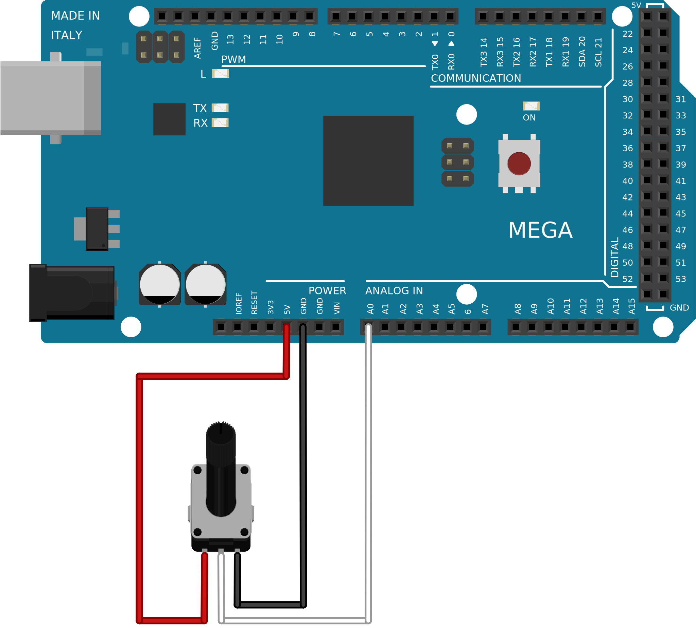
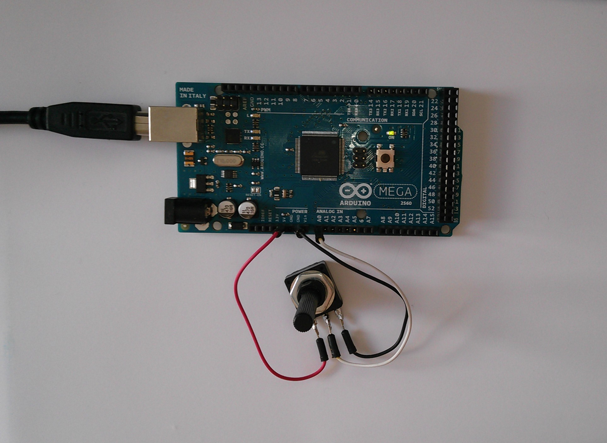

.. author: Lauri Võsandi <lauri.vosandi@gmail.com>
.. tags: Tiigriülikool, Estonian IT College, Arduino, GPIO
.. license: cc-by-3
.. date: 2013-10-31

Arduino analoogsisendid
=======================

Sissejuhatus
------------

Analoogsisendeid on Arduino Unol ning Arduino Megal vastavalt 6 ja 16.
Erinevalt digitaalsisendist on igasugune pinge vahemikus
0V ... 5V analoogsisendi puhul sisukas:
Atmega mikrokontroller teisendab 0V ... 5V pinge
10-bitiseks täisarvuks vahemikus 0 kuni 1023.

Potensiomeetri ühendamine
-------------------------

Käesolevas näites ühendame potensiomeetri analoogsisendiga.
Potensiomeeter on sisuliselt reguleeritava väärtusega takisti või
takistite paar, kui kõik kolm jalga kasutusele võtta.
Potensiomeetri võib leida näiteks vanemast võimendist/raadiost
helitugevuse reguleerimiseks või vanalt kineskoopkuvarilt
kontrastsuse/heleduse reguleerimiseks.

    Ühendamise skeem

Antud juhul kasutame 100kΩ potensiomeetrit, kuid samahästi peaks sobima
suvaline potensiomeeter, mille takistus on rohkem kui 1kΩ.
Potensiomeetri takistus peab olema piisavalt suur, et seda
läbiv vool ei põhjustaks potensiomeetri läbipõlemist või ülemäärast kuumenemist.
Samas liiga suure takistuse puhul, näiteks 1MΩ, võib näit ebatäpsemaks minna.
Ühendades potensiomeetri ühe äärmise jala maha ning teise äärmise jala 5V
toitepingega, saavutame sujuvalt valitava pinge vahemikus 0V ... 5V
potensiomeetri kesmisele väljavõtte jalale.

    Foto ühendatud skeemist

Koodinäide
----------

Koodinäites loeme igas tsüklis pinge analoogsisendil A0 ning seejärel
hoiame näidule vastava hulga millisekundeid Arduino plaadil olevat valgusdioodi
sisselülitatud olekus ning siis sama kaua väljalülitatud olekus.
Lõpptulemusena saab potensiomeetri abil
seadistada Arduino plaadil oleva valgusdioodi vilkumise sagedust.

.. code:: cpp

    int led = 13;

    void setup() {                
        pinMode(led, OUTPUT);     
    }

    void loop() {
        int value = analogRead(A0);
        digitalWrite(led, HIGH);
        delay(value);
        digitalWrite(led, LOW);
        delay(value);
    }

Harjutused
----------

* Kasutades *Serial* klassi edasta analoogsisendi näit arvutiekraanile
* Teisenda *analogRead()* funktsiooni täisarvuline tagastatud väärtus, ujukomaarvuks voltides
* Teisenda voltide näit vastavalt väärtusele, nt 4.5 -> 4.5V ning 0.25 -> 250mV
