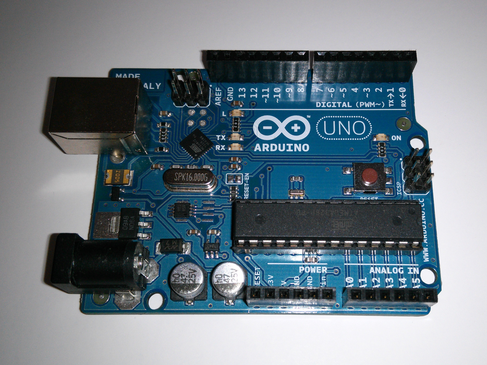

.. title: Arduino Uno
.. author: Lauri Võsandi <lauri.vosandi@gmail.com>
.. tags: Tiigriülikool, Estonian IT College, Arduino, Atmel, private
.. date: 2013-10-31
.. language: et
.. license: cc-by-3

Sissejuhatus
------------

`Arduino <http://www.arduino.cc/>`_
on avatud lähtekoodiga mikrokontrolleriplatvorm,
mis kätkeb endas mitut erinevat komponenti:

* Atmega mikrokontrolleril baseeruv krediitkaardisuurune prototüüpimisplaat.
* Lihtsustatud C++ ning *Wiring* baasil programmeerimiskeel.
* *Processing* baasil arenduskeskkond.
* Alglaadur mikrokontrollerile, mis võimaldab tarkvara uuendada üle USB
  või jadaliidese.

Kõik komponendid on avatud lähtekoodiga ning iga huviline
võib endale kokku joota Arduino klooni.

Riistvara
---------

Arduino riistvarast on mitu erinevat varianti. Kõige populaarsem neist on
Arduino Uno, mis baseerub Atmega328P mikrokontrolleril:

Arduino Uno südameks on 28 väljaviiguga Atmega328P mikrokontroller.
28-st väljaviigust 20 tükki on tarkvaraliselt juhitavad
(*programmable* *input/output* *pins*)
ning neid saab programmeerida täitma erinevaid ülesandeid:

* 20-nel väljaviigul on digitaalse
  `sisendi lugemise <arduino-digital-input.html>`_ ning
  `väljundi kirjutamise <arduino-digital-output.html>`_
  võimekus, mis tähendab seda, et nende jalgade külge võib ühendada
  nuppe või releesid ning tarkvaras vastavalt nupuvajutusi tuvastada
  või relee kaudu näiteks elektriboilerit juhtida.
* 6 jalal on `pulsilaiusmodulatsiooni võimekus <pwm-simulator.html>`_,
  mis tähendab et nende jalgadega saab dimmerdada näiteks LED valgusteid.
* 6 jalga toimivad `10-bitiste analoogsisenditena <arduino-analog-input.html>`_,
  mis tähendab et jalale antud pinge vahemikus 0V kuni 5V teisendatakse täisarvuliseks numbriks 0 kuni 1023.

Atmega328P mikrokontrolleril on 32kB välkmälu (*Flash*) tarkvara jaoks.
Sellest on 512 baiti reserveeritud Arduino alglaaduri jaoks.
Seadistuste jaoks on ette nähtud 1kB püsimälu (*EEPROM*) ning
jooksvate muutujate jaoks 2kB juhupöördlusmälu (*SRAM*).

Arduino saab oma toite USB pesast, kuid saab kasutada ka välist toiteplokki
pingega 6V kuni 20V. Soovitatav pingevahemik on välise toiteploki puhul 7V kuni 12V.
Väline toiteplokk ning USB pesa võivad olla ühendatud samaaegselt,
Arduino kasutab toiteks automaatselt välist toiteplokki kui see on ühendatud.
Välise toiteploki pesa on ühendatud *Vin* pesaga.

Mil moel Atmega328P mikrokontrolleri jalad on ühendatud 
Arduino päistega annab aimu järgnev skeem:

.. code::

                        +--------\__/--------+
           Reset nupp --| 1. PC6     28. PC5 |-- Arduino A5 (analoogsisend)
  Arduino 0 (UART RX) --| 2. PD0     27. PC4 |-- Arduino A4 (analoogsisend)
  Arduino 1 (UART TX) --| 3. PD1     26. PC3 |-- Arduino A3 (analoogsisend)
            Arduino 2 --| 4. PD2     25. PC2 |-- Arduino A2 (analoogsisend)
      Arduino 3 (PWM) --| 5. PD3     24. PC1 |-- Arduino A1 (analoogsisend)
            Arduino 4 --| 6. PD4     23. PC0 |-- Arduino A0 (analoogsisend)
           Toitepinge --| 7. VCC     22. GND |-- Maa
                  Maa --| 8. GND    21. AREF |-- Analoogsisendite nullnivoo
       16MHz kristall --| 9. PB6    20. AVCC |--
                \-------| 10. PC7    19. PB5 |-- Arduino 13
      Arduino 5 (PWM) --| 11. PD5    18. PB4 |-- Arduino 12
      Arduino 6 (PWM) --| 12. PD6    17. PB3 |-- Arduino 11 (PWM)
            Arduino 7 --| 13. PD7    16. PB2 |-- Arduino 10 (PWM)
            Arduino 8 --| 14. PB0    15. PB1 |-- Arduino 9 (PWM)
                        +--------------------+

Atmel mikrokontrolleri tarkvara
-------------------------------

Atmega328P mikrokontrolleri tarkvara saab paigaldada *avrdude* tarkvara abil.
Ühendamisviise on mitmeid, kõige traditsioonilisem viis on kasutada
ICSP päist mis on ühendatud Atmega328P jalgadele 16,17,18 ning 19.
Arduino puhul on hoopiski mikrokontrollerisse tehases paigaldatud
niinimetatud Arduino alglaadur, mis võimaldab tarkvara uuendada
jadaliidese kaudu mikrokontrolleri jalgadel 2 ning 3.

Tänapäevastel arvutitel pole aga jadaliidest välja toodud,
küll aga on praktiliselt kõikidel olemas USB pesa.
Just seetõttu on kõikidel Arduinodel sisseehitatud USB-jadaliides adapter.
Vanemate plaatide puhul torkab silma FTDI kiip, uuemates
kasutatakse Atmega16U2 mikrokontrollerit, mis on lihtsalt
programmeritud USB-jadaliides sillaks.

Arduino arenduskeskkond
-----------------------

Ubuntu puhul saab lihtsalt paigaldada Arduino tarkvaraarenduskeskkonna,
mis peidab lihtsalt kasutatava graafilise kasutajaliidese taha kõik eelnevalt
nimetatu: C++ baasil teegid, kompileerimise ja püsivara üleslaadimise:

.. code:: bash

    sudo apt-get install arduino

.. [#arduino-uno] `Arduino Uno <http://arduino.cc/en/Main/arduinoBoardUno>`_
.. [#atmega328p] `Atmega328p pinout <http://wiki.attie.co.uk/wiki/Atmega328p>`_
.. [#codebender] `codebender <http://codebender.cc/>`_
