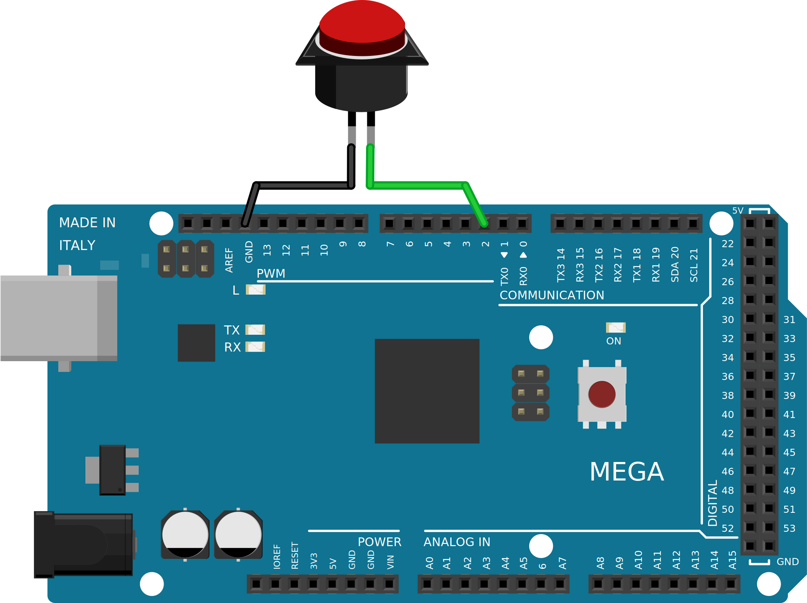

.. author: Lauri Võsandi <lauri.vosandi@gmail.com>
.. tags: Tiigriülikool, Estonian IT College, Arduino, GPIO
.. date: 2014-06-02
.. license: cc-by-3

Arduino digitaalsisend ja nupuvajutuste lugemine
================================================

Sissejuhatus
------------

Digitaalsisendeid on Arduino Uno-l ning Arduino Mega-l vastavalt
14 ning 54. Analoogsisendite jalgu saab kasutada
digitaalsete sisendite ning väljunditena, mis teeks maksimaalseks võimalikuks
pesade arvuks vastavalt 20 ning 70 [#digital-pins]_. Samas tuleks tähele panna seda,
et TX0 ning RX0 pesad, mis kuuluvad digitaalsisendite/väljundite hulka,
on vaikimisi seadistatud Arduino USB-UART silla koosseisu.
Nende kasutamine Arduino koodis võib põhjustada suurt
peavalu järgmisel korral Arduinosse tarkvara üles laadimisel.

Pesade seadistamine
-------------------

Digitaalse sisendi/väljundi pesad on vaikimisi seadistatud digitaalsisendi režiimi
ning *pinMode* funktsiooniga pole vaja pesasid ümber seadistada.
Digitaalsisend on vaikimisi ka 
`kõrge takistusega olekus <logic-values.html#olek-z>`_ (*high*-*impediance* *state*),
mis tähendab seda, et pesa ei ole ühendatud ei maaga (0V) ega toitepingega (5V).
Sisendi rajad trükkplaadil korjavad üles elektromagnetmüra lähedalasuvatelt
radadelt ja keskkonnast ning *digitalRead()* funktsioon tagastab
näiliselt suvalisi väärtusi.
Säärast nähtust nimetatakse "ujuvaks jalaks" (*floating* *pin*).

Kõrge takistusega olek on täiesti sobiv, kui sisendile antud pingenivoo on
alati 0V või 5V, näiteks kui liidestatakse mõne teise mikrokontrolleri, sensori
või muu elektroonikakomponendiga.
Tihtipeale on tarvis sisend tüürida teatud oleku suunas,
kui sisend on ühendamata, näiteks kõige tavalisema nupu või lüliti puhul.
Selleks kasutakse *pull-up* või *pull-down* takisteid, mis on ühendatud
vastavalt kas toitepingega (5V) või maaga (0V).

Pull-up takistid
----------------

Arduino puhul on *pull-up* takistid sisse-ehitatud ning
neid saab tarkvaraliselt sisse lülitada.
Praktikas tähendab see seda, nupp ühendatakse maa ning digitaalsisendiga.
Kui nupp on lahtises olekus, on pesa läbi sisemise ~1.5kΩ *pull-up* takisti
`justkui Arduino toitepingega ühendatud <logic-values.html#olek-h>`_.
ning digitaalsisendit lugedes 
on väärtus sellel kõrge (5V).
Nupu alla vajutades lühistatakse digitaalsisend maaga ja 
`pingenivoo pesal muutub madalaks (0V) <logic-values.html#olek-0>`_.
Senikaua kui nupp on alla vajutatud voolab läbi sisemise *pull-up* takisti
3mA vool toitepingelt maha ning nupu lahti lastes vool katkeb.

Koodinäide
----------

Kõige lihtsamas näites seadistame 13-nda pesa digitaalväljundiks,
kuna selle pesa külge on ühendatud ka Arduino plaadil olev valgusdiood.
Lüliti ühendame 2-nda pesa ning maa külge [#button]_.

.. code:: cpp

    int led = 13;
    int button  = 2;

    void setup() {                
        pinMode(led, OUTPUT);         // Seadista 13 jalg digitaalväljundiks
        pinMode(button, INPUT);       // Seadista 2 jalg digitaalsisendiks
        digitalWrite(button, HIGH);   // Lülita sisse pull-up takisti
    }

    void loop() {
        if (digitalRead(button) == HIGH) {
            digitalWrite(led, HIGH);
        } else {
            digitalWrite(led, LOW);
        }
    }
    
Visuaalseld aitab hädast välja järgnev Fritzing skeem:

    Arduino ühendatud nupuga pessa number 2

Näitest annab parema variandi luua `katkestuste <interrupts.html>`_ (*interrupts*) abil

.. [#button] `Arduino - Button <http://arduino.cc/en/tutorial/button>`_
.. [#digital-pins] `Arduino - Digital Pins <http://arduino.cc/en/Tutorial/DigitalPins>`_
