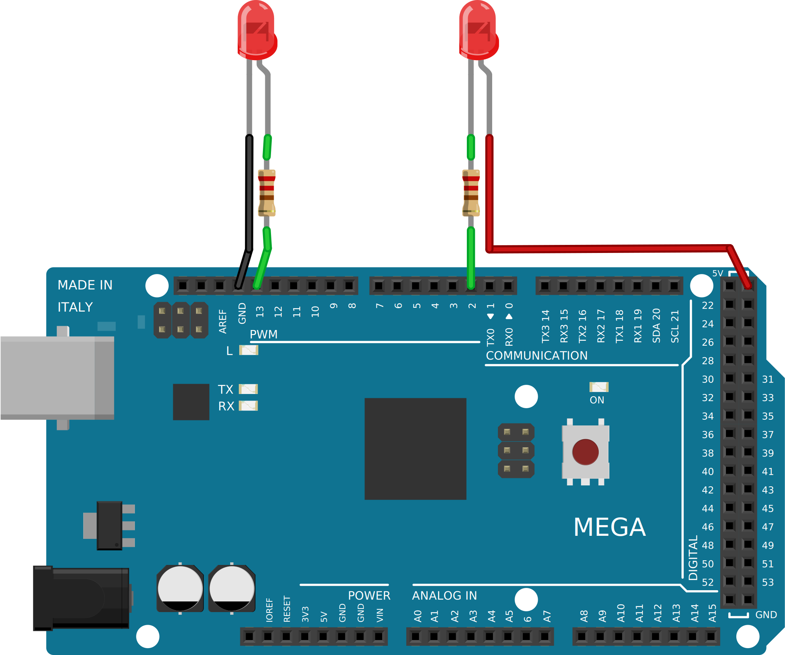

.. author: Lauri Võsandi <lauri.vosandi@gmail.com>
.. tags: Tiigriülikool, Estonian IT College, Arduino, GPIO
.. date: 2014-06-03
.. license: cc-by-3

Arduino digitaalväljund ja valgusdioodide juhtimine
===================================================

Sissejuhatus
------------

Digitaalväljundeid on Arduinol sama palju kui 
`digitaalsisendeidki <digital-inputs.html>`_ [#arduino-digital-pins]_.
Digitaalväljundi lubamiseks tuleb pesad seadistada väljundi režiimi
*pinMode()* funktsiooni abil.
Seejärel saab *digitalWrite()* funktsiooni abil iga
pesa pingenivood tõsta kõrgele (*HIGH*) või suruda maha (*LOW*).
Kõrge pingenivoo puhul on pesa läbi sisseehitatud transistori (*pin* *driver*)
ühendatud Arduino toiteallikaga (5V),
öeldakse ka et pesa on voolu lähteallikaks (*pin* *sources* *current*).
Madala pingenivoo puhul on pesa läbi sisseehitatud transistori ühendatud maaga (0V),
öeldakse ka et pesa maandab voolu (*pin* *sinks* *current*).

Valgusdioodi toitmine digitaalväljundiga
----------------------------------------

Nii nagu `valgusdioodi toitmisel patareiga <led.html>`_, tuleb valgusdioodi toitmisel
mikrokontrolleriga leida valgusdioodi jaoks sobiv takisti.
Ühelt poolt et läbi ei põleks Arduino mikrokontrolleri digitaalväljundi transistor
ning teiselt poolt valgusdiood ise:

.. math::

    R_{takisti} = \frac {\Delta U_{takisti}}{I} = \frac{U_{toitepinge} - \Delta U_{valgusdiood}}{I} = \frac {5V - 1.8V}{20mA} = 160Ω

Iseenesestmõistetavalt täpselt sellise väärtusega takistit ei leia,
sobivad ka näiteks 130Ω, 220Ω ning 330Ω.

Valgusdioodi ühendamine
-----------------------

Valgusdioodi omapäraks on see, et valgusdiood laseb voolu läbi vaid ühes suunas.
Kuna digitaalväljundi pingenivoo on seadistatav tarkvaraliselt, saab muuta
voolu suunda digitaalväljundi pesale ühendatud tarbijas.
Järgnevalt on välja toodud fundamentaalselt kaks erinevat varianti
kuidas tarbijaid digitaalväljundiga ühendada:

    Kaks viisi kuidas tarbijat mikrokontrolleri külge ühendada.

Vasakpoolses variandis voolab vool pesalt 13 läbi valgusdioodi maha.
Parempoolses variandis liigub vool toitepingelt läbi valgusdioodi
pesale 2. Mõlema valgusdioodid saab põlema järgneva koodijupiga:

.. code:: cpp

    void setup() {
        pinMode(13, OUTPUT);
        pinMode(13, HIGH);
        pinMode(2, OUTPUT);
        pinMode(2, LOW);
    }

Digitaalväljundi maksimaalne vool
---------------------------------

Atmega dokumentatsioonist leiab, et on soovitatav voolu piirata 20mA ringis pesa kohta.
Tegelikult ei juhtu ka miskit hullu kui mõnda pesa käitatakse 40mA vooluga.
Soovitatud vool 20mA ei ole kuigi suur vool, 5V toitepinge juures tähendab
see kõigest 100mW võimsust pesa kohta. Säärase vooluga võib käitada valgusdioodi
või tosinat sensorit, kuid releede, mootorite, valgustitena kasutatavate
valgusdioodide ja muude võimsate seadmete juhtimiseks on vaja
`transistoreid <transistor.html>`_ või `väljatransistoreid <mosfet.html>`_ ning vastavat toiteallikat.

.. [#arduino-digital-pins] `Arduino - Digital Pins <http://arduino.cc/en/Tutorial/DigitalPins>`_
