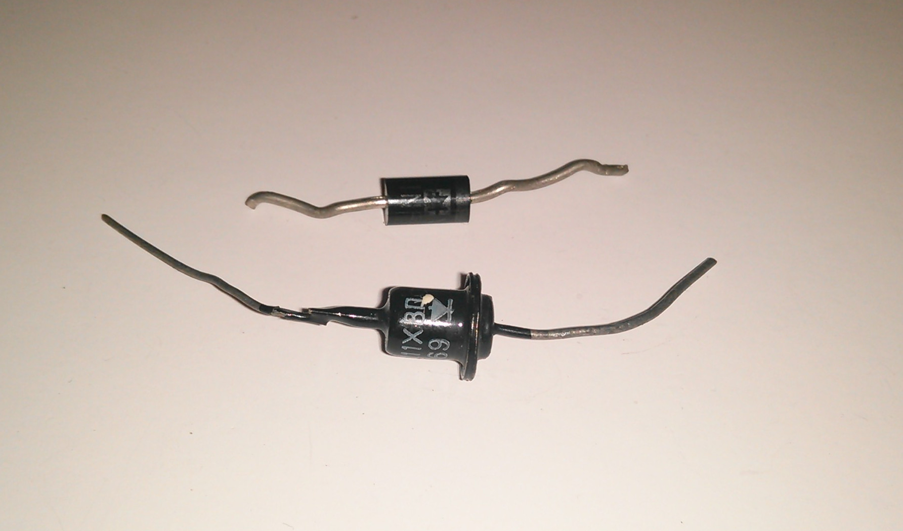

.. title: Diood
.. author: Lauri Võsandi <lauri.vosandi@gmail.com>
.. license: cc-by-3
.. tags: Tiigriülikool, Estonian IT College, Arduino, LED
.. date: 2013-10-31

Diood
=====

Diood on elektroonikakomponent, mille eesmärgiks on tagada elektronide
liikumine ühes suunas. Pärisuuna puhul dioodi elektriline 
takistus on praktiliselt olematu ning vastupidises suunas läheneb lõpmatusele.
Dioodi tööpõhimõte tugineb pooljuhtide PN-siirde omapäradele.
Dioodi omapäraks on see, et sellel on konstante pingelang vahemikus 1V kuni 1.5V
ning see ei ole seotud toitepingega lineaarselt.
Dioodil on teda läbiva voolu ülempiir, mille ületades dioodi eluiga 
märgatavalt väheneb kuni kiire läbipõlemiseni.

Dioodi põhimõttel toimivaid elektroonikakomponente on teisigi:

* `Valgusdiood <led.html>`_
* `Zener <zener.html>`_
