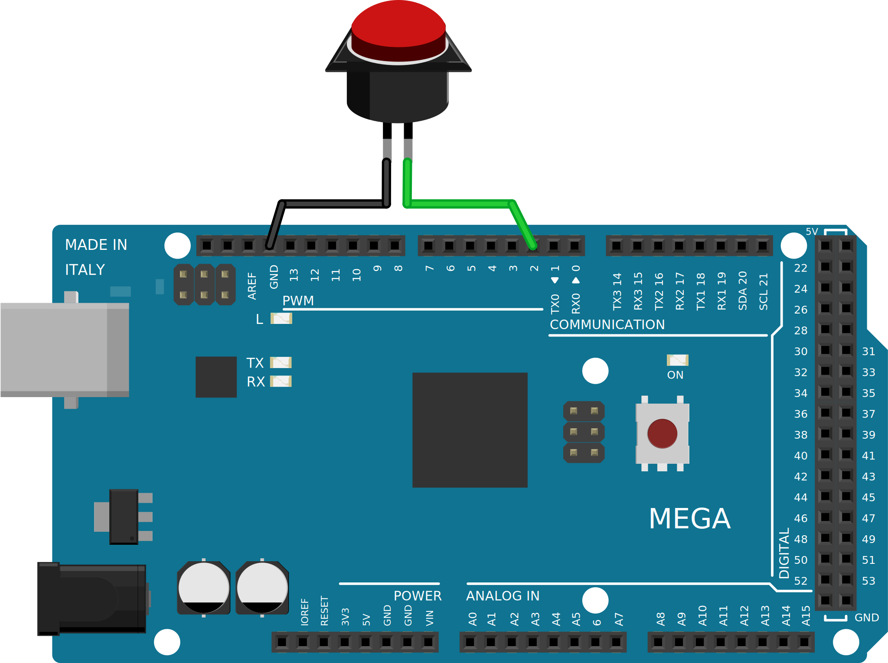

.. title: Arduino katkestused
.. author: Lauri Võsandi <lauri.vosandi@gmail.com>
.. tags: Tiigriülikool, Estonian IT College, Arduino, GPIO
.. date: 2014-06-04
.. language: et
.. license: cc-by-3

Sissejuhatus
------------

Osadel Arduino pesadel on katkestuste (*interrupt*) võimekus, mis lubab
digitaalsisendi lugemist optimeerida. Selle asemel et tsüklis korduvalt
`digitaalsisendi väärtust lugeda <arduino-digital-input.html>`_,
saab Arduino mikrokontrolleri programmeerida
käivitama funktsiooni kui huvi pakkuv sündmus aset leiab.

Arduino Uno puhul on katkestuste kasutamine võimalik pesadel 2 ning 3.
Arduino Mega 2560 puhul on see lisaks veel toetatud pesadel 18, 19, 20 ja 21.
Arduino Due puhul on katkestused võimalikud kõigil pesadel.

Katkestuste liigid
------------------

Sündmuseid mille peale katkestuse funktsioon käivitatakse on laias
laastus viite tüüpi: 

* *LOW* - Käivita funktsioon mil iganes digitaalsisend on madalal pingenivool.
* *RISING* - Käivita funktsioon kui digitaalsisendi tõeväärtus muutub tõeseks.
* *CHANGE* - Käivita funktsioon kui digitaalsisendi tõeväärtus muutub.
* *FALLING* - Käivita funktsioon kui digitaalsisendi tõeväärtus muutub vääraks.
* *HIGH* - Käivita funktsioon mil iganes digitaalsisend on kõrgel pingenivool,
  see funktsionaalsus on hetkel küll toetatud ainult Arduino Due mikrokontrolleril
  
Arduino Uno ning Arduino Mega 2560 puhul on katkestused nummerdatud järgnevalt:

* Pesa nr 2 → Katkestus nr 0
* Pesa nr 3 → Katkestus nr 1
* Pesa nr 18 → Katkestus nr 5
* Pesa nr 19 → Katkestus nr 4
* Pesa nr 20 → Katkestus nr 3
* Pesa nr 21 → Katkestus nr 2

Koodinäide
----------

Nupuvajutust võib lugeda näiteks järngeva koodijupiga:

.. code:: cpp

    int led = 13;
    int button  = 2;
    int buttonInterrupt = 0;

    void setup() {                
        pinMode(led, OUTPUT);         // Seadista 13 jalg digitaalväljundiks
        pinMode(button, INPUT);       // Seadista 9 jalg digitaalsisndiks
        digitalWrite(button, HIGH);   // Lülita sisse pull-up takisti
        
        // Seosta sündmused funktsioonidega
        attachInterrupt(buttonInterrupt, onButtonPressed, FALLING);
        attachInterrupt(buttonInterrupt, onButtonReleased, RISING);
    }
    
    void onButtonPressed() {
        digitalWrite(led, HIGH);
    }
    
    void onButtonReleased() {
        digitalWrite(led, LOW);
    }

    void loop() {
        // Tee midagi asjalikku
    }
    
Skeemina kasutame sama mida kõige lihtsamaski
`digitaalsisendi lugemise <arduino-digital-input.html>`_ näites:

Kokkuvõte
---------

Katkestusi kasutades saame vabastada *loop()* funktsiooni nupu lugemisest
ning seal hoopis midagi muud asjalikku teha. Tähele tuleks panna seda,
et katkestuse funktsiooni (*interrupt* *handler*)
sisu peaks olema nii lühike kui võimalik.
Katkestuse funktsiooni käivitamisel salvestatakse mikrokontrolleri olek, 
ning muu sel ajal käitatud funktsioon pannakse pausile.
Katkestuse funktsiooni lõpetamisel jätkab mikrokontroller samast kohast.

Viited
------

* `attachInterrupt() <http://arduino.cc/en/Reference/attachInterrupt>`_
