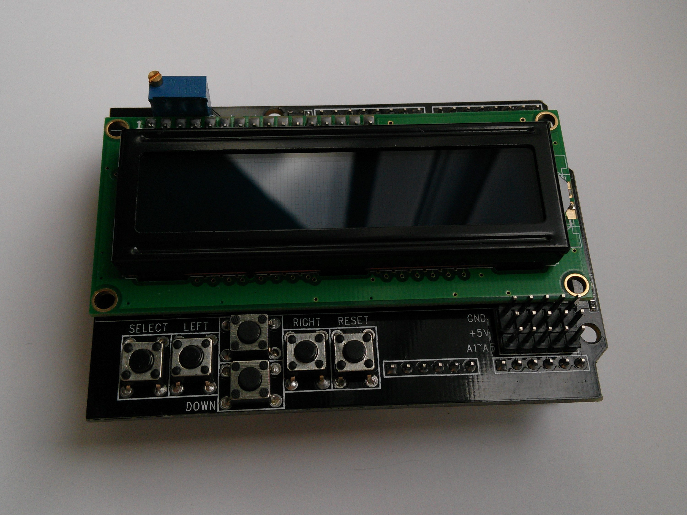
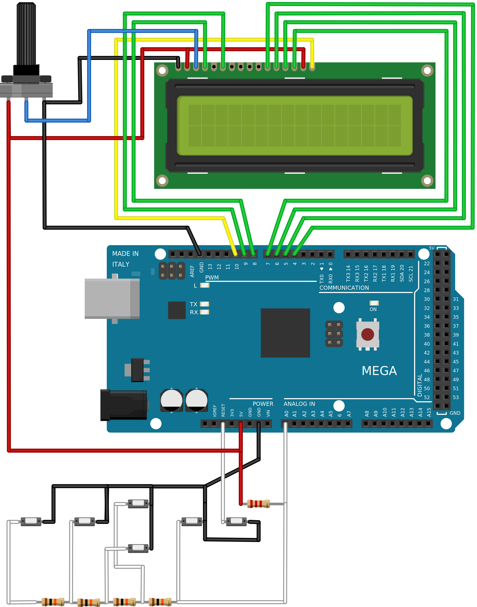

.. author: Lauri Võsandi <lauri.vosandi@gmail.com>
.. license: cc-by-3
.. tags: Tiigriülikool, Arduino, Estonian IT College, HD44780
.. date: 2014-06-05

LCD1602 key shield
==================

Sissejuhatus
------------

LCD1602 key shield on 16x2 sümbolit LCD ekraaniga ning 6 nupuga Arduino *shield*
mis istub ilusti Arduino Uno ja Arduino Mega selga. Iga sümbol koosneb
5x7 pikslist ning kaheksat sümbolit on võimalik kasutajal ka
kohandada.

    LCD1602 shield sobitub erinevate Arduino mudelitega

LCD1602 põhineb Hitachi HD44780 LCD kontrolleril [#hd44780]_ [#hd44780-datasheet]_ mis võib opereerida nii
4-bitises režiimis kui ka 8-bitises režiimis, vajaminevate väljaviikude hulk on 
vastavalt 6 või 10.
Hitachi HD44780 kontrolleriga või selle kloonidega
(Sunplus SPLC780D, Sitronix ST7065C, Samsung S6A0069 [#s6a0069]_ jpt) realiseeritakse
lihtsaid kasutajaliideseid kohvimasina, piletiautomaadi või joogiautomaadi jaoks.

Shieldi realiseeritud skeem
------------------------------

Käesolev LCD1602 opereerib 4-bitises režiimis, mis tähendab et ta kasutab nelja
väljaviiku andmete lugemiseks/kirjutamiseks ning kahte väljaviiku
ekraani juhtimiseks.

Sõltumata sellest, kas kasutusel on Arduino Uno (Atmega328p mikrokontroller),
või Arduino Mega 2560 (Atmega2560 mikrokontroller) on Arduino kood sama.
Seevastu C kood näiteks erineb, kuna erinevate Arduino plaatide puhul on
pesad ühendatud erinevate registrite külge.

LCD1602 shield on ühendatud järgnevalt [#conn]_:

.. code::

                        LCD module pin 1   <->  Arduino GND
                        LCD module pin 2   <->  Arduino 5V
                        LCD module pin 3   <->  Kontrasti potensiomeeter
    HD44780 RS     <->  LCD module pin 4   <->  Arduino pin 8   <->  Atmega328p PB0
    HD44780 EN     <->  LCD module pin 6   <->  Arduino pin 9   <->  Atmega328p PB1
    HD44780 B4     <->  LCD module pin 11  <->  Arduino pin 4   <->  Atmega328p PD4
    HD44780 B5     <->  LCD module pin 12  <->  Arduino pin 5   <->  Atmega328p PD5
    HD44780 B6     <->  LCD module pin 13  <->  Arduino pin 6   <->  Atmega328p PD6
    HD44780 B7     <->  LCD module pin 14  <->  Arduino pin 7   <->  Atmega328p PD7
    Backlight 5V   <->  LCD module pin 15  <->  Arduino 5V
    Backlight GND  <->  LCD module pin 16  <->  Arduino pin 10
                        Nupud              <->  Arduino pin A0

Visuaalselt aitab aru saada järgnev skeem:

    LCD1602 shieldi realiseeriv skeem
    
Kasutamine
----------

Arduino koodis on LCD-ekraani kasutamine üsna lihtne, kuna
HD44780 kontrolleriga ekraanide jaoks on ette nähtud *LiquidCrystal* teek [#liquidcrystal]_,
mis hõlbustab sääraste ekraanide kasutamist.
Teegis on defineeritud *LiquidCrystal* klass,
millest objekti loomisel peab argumentideks kaasa andma
jalgade numbrid, kuhu HD44780 mikrokontroller on ühendatud [#prog]_.

.. code:: cpp

    #include <LiquidCrystal.h>

    LiquidCrystal lcd(8, 9, 4, 5, 6, 7);

    void setup() {
        // Initsialiseeri 16 tulba ja 2 reaga
        lcd.begin(16, 2);
        lcd.setCursor(0, 0);
        lcd.print("Tere maailm!");
    }

    void loop() {
        lcd.setCursor(0, 1);
        lcd.print(millis()/1000);
        lcd.print(" s");
    }

Täpitähed
---------

Täpitähtedega on asi mõnevõrra keerukam, kuna tähetabel mida kasutab HD44780
ei vasta ühelegi standardiseeritud tähetabelile mis säilitab sümbol-bait vaste
(nt ISO8859-13 vms) ning teisalt on Arduino lähtekoodi fail tüüpiliselt
Unicode tähetabelis, kus näiteks tähele õ vastab kaks baiti 0xC3 ning 0xB5.
Seega lcd.print("õ") saaks argumendiks tegelikult kahebaidilise sõne ning
sääraste tähetabelite kasutamine mikrokontrolleri puhul oleks mahukas ettevõtmine.

Kõige lihtsam on LCD kontrolleri *datasheet*-ist kontrollida, missugune
tähetabel on selle sisse programmeeritud ning mis baidid vastavad soovitud sümbolitele.
Käesolevas kontrolleris on olemas väikesed täpitähed "ä", "ö" ja "ü".
Neile vastavad baitide väärtused on vastavalt 0xE1, 0xEF ning 0xF5.
Eesti keelele unikaalset "õ"-d paraku HD44780 kontrollerisse sisse
programmeeritud pole, samas saab siinkohal ära kasutada 8 programmeeritava
sümboli võimalusi:

.. code:: cpp

    #include <LiquidCrystal.h>

    LiquidCrystal lcd(8, 9, 4, 5, 6, 7);
    
    // Täpitähed
    const char LCD_AUML = 0xE1;
    const char LCD_OUML = 0xEF;
    const char LCD_UUML = 0xF5;
        
    // Pisikese õ jaoks loome eraldi sümboli
    const char LCD_OTILDE = 0x07;
    byte LCD_OTILDE_BITMAP[8] = {
        0b01101,
        0b10010,
        0b01110,
        0b10001,
        0b10001,
        0b10001,
        0b01110
    };

    void setup() {
        // Initsialiseeri 16 tulba ja 2 reaga
        lcd.begin(16, 2);
        
        // Loo õ jaoks kohandatud bitmap-iga sümbol
        lcd.createChar(LCD_OTILDE, LCD_OTILDE_BITMAP);
        
        // Liigu esimese rea algusesse
        lcd.setCursor(0, 0);
        
        // Kuva "möirgav lõukoer"
        lcd.print("m");
        lcd.print(LCD_OUML);
        lcd.print("irgav l");
        lcd.print(LCD_OTILDE);
        lcd.print("ukoer");
        
        // Liigu teise rea algusesse
        lcd.setCursor(0, 1);

        // Kuva "hüppas tänaval"
        lcd.print("h");
        lcd.print(LCD_UUML);
        lcd.print("ppas t");
        lcd.print(LCD_AUML);
        lcd.print("naval");
    }

    void loop() {
    }

Käesoleval LCD1602 moodulil on ka viis analoogsisendit välja toodud, mida
saab kasutada näiteks potensiomeetri või kaugussensori väärtuse lugemiseks.
Analoogseid mooduleid leiab nii DealExtremest [#dx]_ kui eBayst.

.. [#hd44780] `Hitachi HD44780 LCD controller <http://en.wikipedia.org/wiki/Hitachi_HD44780_LCD_controller>`_
.. [#hd44780-datasheet] `HD44780 datasheet <https://www.sparkfun.com/datasheets/LCD/HD44780.pdf>`_
.. [#s6a0069] `S6A0069 datasheet <http://www.cloverdisplay.com/pdf/S6A0069.pdf>`_
.. [#liquidcrystal] `LiquidCrystal Library <http://arduino.cc/en/Reference/LiquidCrystal>`_
.. [#conn] `HD44780 Character LCD Displays <http://www.protostack.com/blog/2010/03/character-lcd-displays-part-1/>`_
.. [#prog] `How to connect an Arduino UNO to an LCD 1602 <http://electronics.stackexchange.com/questions/34178/how-to-connect-an-arduino-uno-to-an-lcd-1602>`_
.. [#dx] `DealExtreme <http://dx.com/p/lcd-keypad-shield-for-arduino-duemilanove-lcd-1602-118059>`_

