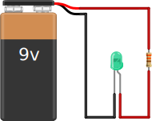

.. title: Valgusdiood
.. author: Lauri Võsandi <lauri.vosandi@gmail.com>
.. license: cc-by-3
.. tags: Tiigriülikool, Arduino, Estonian IT College, LED
.. date: 2013-10-31

Valgusdiood
===========

Sissejuhatus
------------

Valgusdiood kuulub ühte `dioodi <diode.html>`_ alamkategooriatesse.
Valgusdiood emiteerib kindla pooljuhi omadustest tuleneva lainepikkusega footoneid [#liquid-nitrogen]_
elektronide liikumisel pärisuunas.

    Valik valgusdioode

Kõige enim levinud on rohelised ning punased valgusdioodid, mida kasutatakse
indikaatoritena. Sääraste valgusdioodide pingelang on tavaliselt 1.8V,
kuid sõltuvalt pooljuhist võib esineda ka 3.3V pingelanguga siniseid valgusdioode.
Indikaatoritena kasutatavad valgusdioodid on enamasti disainitud töötama
20mA vooluga, valgustitena kasutatavad valgusdioodid on oluliselt võimsamad,
tarbides 100mA kuni 500mA voolu.

Valgusdioodi ühendamine
-----------------------

Valgusdioodi ühendamisel on oluline, et valgusdioodi ei läbiks
liiga suur vool. Indikaatorina kasutatava valgusdioodi
puhul näiteks tõuseb märgatavalt valgusdioodi temperatuur ning valgus muutub kollakamaks.
Voolu piiramiseks kasutatakse tavaliselt takistit.

Käesolevas katses kasutame 9V patareid ning rohelist valgusdioodi.
IT Kolledži robootikaklubi (t)räniorust leiab kamaluga mitmesuguseid valgusdioode,
takisteid ning toiteallikaid millega käesolevat katset läbi viia:

    9V patarei, valgusdiood ning takisti vooluring

Tingmärkidega ülestähendatult näeks skeem välja umbes selline:

.. figure:: fritzing/9v-led_schematic.svg
    :width: 50%

    Vooluring tingmärkidega ülestähendatult
    
Takisti arvutamine
------------------

Toiteallikas 9V patarei:

.. math::

    U = 9V
    
Eeldame, et valgusdioodi läbiv maksimaalne vool on 20mA.
Selle numbri leiab üles valgusdioodi spetsifikatsioonist:

.. math::
    
    I = 20mA = 0.02A
    
Pingelang valgusdioodil 1.8V, selle samuti leiab valgusdioodi spetsifikatsioonist:

.. math::
    
    \Delta U_{valgusdiood} = 1.8V

Siit võime edasi tuletada vajaliku pingelangu takistil et valgusdiood läbi ei põleks:

.. math::

    \Delta U_{takisti} = U - \Delta U_{valgusdiood} = 9V - 1.8V = 7.2V
    
Seejärel takisti väärtuse:

.. math::

    R_{takisti} = \frac{\Delta U_{takisti}}{I} = \frac{7.2V}{0.02A} = 360Ω
    
Ilmselt on 360Ω takistit üpris raske leida, küll aga peaks leidma mõne 330Ω või 470Ω takisti
mis sobib ka käesolevasse skeemi.
Takistuste arvutamisel tuleb abiks valgusdioodi skeemisimulaator [#sim]_.

.. [#sim] `Valgusdioodi skeemisimulaator <led-simulator.html>`_
.. [#liquid-nitrogen] `Orange LED changes color in liquid nitrogen <http://www.youtube.com/watch?v=4qgPhNHJPB8>`_
