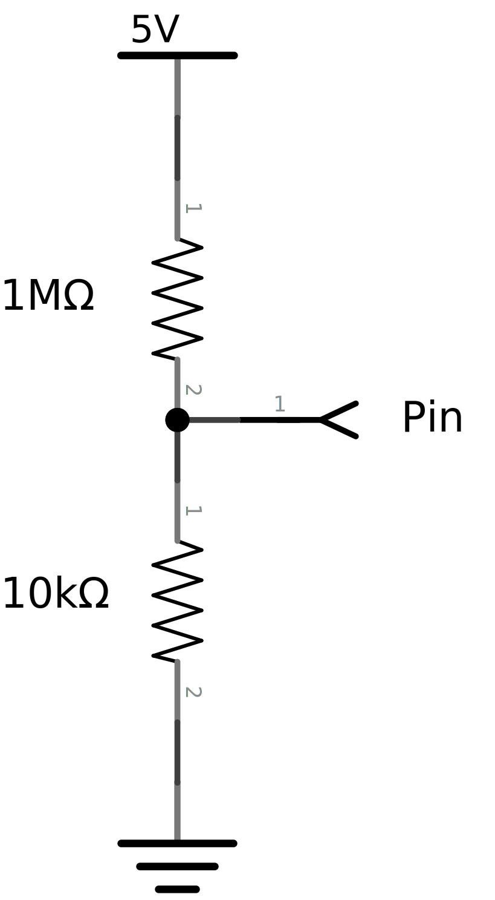

.. title: Digitaalloogika olekud
.. author: Lauri Võsandi <lauri.vosandi@gmail.com>
.. license: cc-by-3
.. tags: Tiigriülikool, Arduino, Estonian IT College
.. date: 2013-10-31

Sissejuhatus
------------

Digitaalsisenditest ja -väljunditest rääkides tekib tihtipeale segadus
mis mida tähendab. Suvalise mikrokontrolleri sisend- ja väljundviikudel
eristatakse vähemalt viite olekut.
Skeem väljendab mikrokontrolleri sisemisi ühendusi, et kuidas nad
väljapoole paistavad sõltuvalt sellest mis seadistustega üks või teine pesa on.
Skeemil märgitud väga suure 1MΩ takistusega takisti võib lugeda
võrdväärseks ühenduse puudumisega.

Olek Z
------

Vaikimisi on kõik Arduino analoogsisendid, digitaalsisendid ja -väljundid kõrge
takistusega olekus (*high-impediance* *state*).
Selles olekus saab lugeda väärtust pesal -
`digitaalsisendi puhul <arduino-digital-input>`_ kas pesal on madal või kõrge pingenivoo,
`analoogsisendi puhul <arduino-analog-input>`_ saab lugeda pinge väärtust.

.. image:: fritzing/pin-floating_schematic.svg
    :align: center
    
Pesa mis on olnud muus suvalises konfiguratsioonis saab panna Z-olekusse järgneva koodijupiga:

.. code:: cpp

    pinMode(pesaNumber, INPUT);      // Pesa digitaalsisendi režiimi
    digitalWrite(pesaNumber, LOW);   // Lülita välja sisseehitatud pull-up takisti

Olek H
------
Nõrk kõrge pingenivoo (*weak* *high* *state*) kasutatakse 
`digitaalsisendi lugemise <arduino-digital-input>`_ korral,
et kui sisend puudub tüüritaks pinget pesal kõrge pingenivoo poole.

.. image:: fritzing/pin-pull-up_schematic.svg
    :align: center

Arduino kood:

.. code:: cpp

    pinMode(pesaNumber, INPUT);       // Pesa digitaalsisendi režiimi
    digitalWrite(pesaNumber, HIGH);   // Lülita sisse pull-up takisti

Olek L
------
Nõrk madal pingenivoo (*weak* *low* *state*) kasutatakse 
`digitaalsisendi lugemise <arduino-digital-input>`_ korral,
et kui sisend puudub tüüritaks pinget pesal madalama pingenivoo poole.

Arduino puhul seda tarkvaraliselt realiseerida pole võimalik,
ekvivalentse lahenduse saab kui kasutada järgnevat koodijuppi ning
pesa ja maa vahele lisada 1.5kΩ takisti:

.. code:: cpp

    pinMode(pesaNumber, INPUT);      // Pesa digitaalsisendi režiimi
    digitalWrite(pesaNumber, LOW);   // Lülita välja sisseehitatud pull-up takisti

Olek 1
------
Kõrge pingenivooga (*high* *state*) väljendatakse
`tõest tõeväärtust digitaalväljundil <arduino-digital-output>`_:

    
Koodijupp Arduino jaoks:

.. code:: cpp

    pinMode(pesaNumber, OUTPUT);      // Pesa digitaalväljundi režiimi
    digitalWrite(pesaNumber, HIGH);   // Lülita väljund kõrgele pingenivoole

Olek 0
------
Madal pingenivooga (*low* *state*) väljendatakse
`väära tõeväärtust digitaalväljundil <arduino-digital-output>`_:

Koodijupp Arduino tarbeks:

.. code:: cpp

    pinMode(pesaNumber, OUTPUT);     // Pesa digitaalväljundi režiimi
    digitalWrite(pesaNumber, LOW);   // Lülita väljund madalale pingenivoole

Viited
------

* `Four valued logic <http://en.wikipedia.org/wiki/Four_valued_logic>`_
