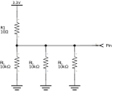

.. author: Lauri Võsandi <lauri.vosandi@gmail.com>
.. license: cc-by-3
.. tags: Tiigriülikool, Arduino, Estonian IT College, IEEE1164, VHDL
.. date: 2013-10-31

Digitaalloogika olekud
======================

Sissejuhatus
------------

Digitaalsisenditest ja -väljunditest rääkides tekib tihtipeale segadus
mis mida tähendab. Suvalise mikrokontrolleri sisend- ja väljundviikudel
eristatakse vähemalt viite olekut.
Järgnevad skeemid väljendavad mikrokontrolleri sisemisi ühendusi, et kuidas nad
väljapoole paistavad sõltuvalt sellest mis seadistustega üks või teine pesa on.
Skeemil märgitud väga suure 1MΩ takistusega takisti võib lugeda
võrdväärseks ühenduse puudumisega.

IEEE 1164
---------

IEEE 1164 standard defineerib koguni 9 olekut:

* 'U' - initsialiseerimata
* 'X' - konflikt
* '0' - madal pingenivoo
* '1' - kõrge pingenivoo
* 'Z' - kõrge takistusega olek
* 'W' - nõrk ajam
* 'L' - nõrk madal pingenivoo, loogiline 0
* 'H' - nõrk kõrge pingenivoo, loogiline 1
* '-' - pole oluline

Olek Z
------

Vaikimisi on kõik Arduino analoogsisendid, digitaalsisendid ja -väljundid kõrge
takistusega olekus (*high-impediance* *state*).
Selles olekus saab lugeda väärtust pesal -
`digitaalsisendi puhul <digital-inputs.html>`_ kas pesal on madal või kõrge pingenivoo,
`analoogsisendi puhul <analog-inputs.html>`_ saab lugeda pinge väärtust.

    
Pesa mis on olnud muus suvalises konfiguratsioonis saab panna Z-olekusse järgneva koodijupiga:

.. code:: cpp

    pinMode(pesaNumber, INPUT);      // Pesa digitaalsisendi režiimi
    digitalWrite(pesaNumber, LOW);   // Lülita välja sisseehitatud pull-up takisti

Olek H
------
Nõrk kõrge pingenivoo (*weak* *high* *state*) kasutatakse 
`digitaalsisendi lugemise <digital-inputs.html>`_ korral,
et kui sisend puudub tüüritaks pinget pesal kõrge pingenivoo poole.

Arduino kood:

.. code:: cpp

    pinMode(pesaNumber, INPUT);       // Pesa digitaalsisendi režiimi
    digitalWrite(pesaNumber, HIGH);   // Lülita sisse pull-up takisti

Olek L
------
Nõrk madal pingenivoo (*weak* *low* *state*) kasutatakse 
`digitaalsisendi lugemise <digital-inputs.html>`_ korral,
et kui sisend puudub tüüritaks pinget pesal madalama pingenivoo poole.

.. figure:: fritzing/pin-pull-down_schematic.svg

Arduino puhul seda tarkvaraliselt realiseerida pole võimalik,
ekvivalentse lahenduse saab kui kasutada järgnevat koodijuppi ning
pesa ja maa vahele lisada 10kΩ takisti:

.. code:: cpp

    pinMode(pesaNumber, INPUT);      // Pesa digitaalsisendi režiimi
    digitalWrite(pesaNumber, LOW);   // Lülita välja sisseehitatud pull-up takisti

Olek 1
------
Kõrge pingenivooga (*high* *state*, *forcing 1*) väljendatakse
`tõest tõeväärtust digitaalväljundil <digital-outputs.html>`_:

.. figure:: fritzing/pin-high_schematic.svg
    
Koodijupp Arduino jaoks:

.. code:: cpp

    pinMode(pesaNumber, OUTPUT);      // Pesa digitaalväljundi režiimi
    digitalWrite(pesaNumber, HIGH);   // Lülita väljund kõrgele pingenivoole

Olek 0
------
Madal pingenivooga (*low* *state*, *forcing 0*) väljendatakse
`väära tõeväärtust digitaalväljundil <digital-outputs.html>`_.
10Ω väljendab loogikaelementide sisetakistust:

.. figure:: fritzing/pin-low_schematic.svg

Koodijupp Arduino tarbeks:

.. code:: cpp

    pinMode(pesaNumber, OUTPUT);     // Pesa digitaalväljundi režiimi
    digitalWrite(pesaNumber, LOW);   // Lülita väljund madalale pingenivoole

CMOS pingenivood
----------------

Arduino kasutab CMOS pingenivoosid, mis tähendab seda et Arduino
sisendite ja väljundite pingetase peab jääma 0V ning 5V (toitepinge) vahele.
CMOS puhul loetakse magalaks pingenivooks vahemikku 0V ja kolmandiku toitepinge vahel ning
kõrge pingenivoo kahe kolmandiku ja toitepinge vahel.
Numbritesse panduna on see:

.. math::

    V_{0L} = \frac{1}{3} \times V_DD = \frac{1}{3} \times 5V = \frac{5}{3} V \approx 1.5V
    
.. math::

    V_{0H} = \frac{2}{3} \times V_DD = \frac{2}{3} \times 5V = \frac{10}{3} V \approx 3.5V
    
    
TTL pingenivood
---------------
    
Raspberry Pi ning ARM plaadid kasutavad TTL pingenivoosid, mis tähendab
et sisendite ja väljundite pingetase peab jääma 0V ning 3.3V (toitepinge) vahele.
TTL puhul madalaks peetav pingenivoo peab jääma 0V  ja 0.8V vahele ning
kõrge pingenivoo on 2V ja toitepinge vahele.

Näide #1
--------

Loogika olekutest arusaamine aitab vältida fundamentaalselt katkiste skeemide disainimist.
Kui näiteks Raspberry Pi-ga juhtida täitureid mille sisendjalg on näiteks olekus L, siis
mitu tükki sääraseid saaks ühele Raspberry Pi jalale ühendada enne kui lugem sisendil
muutub ebamääraseks?

Eeldame, et sensor loeb kõrgeks pingenivooks 2.4V:

.. math::

    U_{0L} = 2.4V

Sisend on maandatud läbi 10kΩ takisti (olek L):

.. math::

    R_L = 10kΩ

Raspberry Pi juhtival jalal on pinge 3.3V:

.. math::

    U_1 = 3.3V

Ning see läbib väljatransistori takistusega 10Ω (olek 1):

.. math::

    R_1 = 10Ω

Kolme sensoriga võiks skeem välja näha nii:

    Kolm olekus L jalga ühendatud kokku olekus 1 jalaga

Esiteks peaksime leidma takstuse mille kaudu Raspberry Pi väljaviiku maandades
pinge kukub 2.4V-ni:

.. math::

    \frac{R}{R + R_1} = \frac{U_{0L}}{U_1} \rightarrow \frac{R}{R + 10Ω} = \frac{2.4V}{3.3V}

.. math::

    2.4V \times (R + 10Ω) = 3.3V \times R

.. math::

    0.9V \times R = 2.4V \times 10Ω

.. math::

    R = \frac{2.4V \times 10Ω}{0.9V} = 26.6(6)Ω

Järgnevalt on vaja leida mitu 10kΩ takistit paralleelis moodustavad väiksema kui 26.6(6)Ω
takistuse:

.. math::
    
    \frac{1}{R} = N \times \frac{1}{R{L}} \rightarrow \frac{1}{26.6(6)Ω} = \frac{N}{10kΩ}

.. math::

    N = \frac{10kΩ}{26.6(6)Ω} \approx 375

Järelikult kui sääraseid täitureid ühendada rohkem kui 375 tükki võib täituril 
tekkida probleem lugemi väärtusega.

Näide #2
--------

Mitu olekus 0 jalga saab kokku ühendada olekus 1 jalaga, enne kui pinge kukub määramata
vahemikku? Intuitiivselt võib kohe öelda, et piisab juba ühest kuna
sisuliselt on tegu lühisega.

Et nüüd numbritesse see panna tuleks kõigepealt arvutada välja mis on olekus 0
jalgade kogutakistus sõltuvalt nende arvust:

.. math::

    \frac{1}{R} = N \times \frac{1}{10Ω} \rightarrow R = \frac{10Ω}{N}

Sealt edasi võime avaldada pinge väljaviigul:

.. math::

    U = \frac{3.3V \times R}{R + 10Ω}

Pistes need valemid lihtsasse Pythoni programmi saame:

.. code:: python

    for N in range(0,10):
        if N == 0:
            #R = infinity
            print "N=0 R=     ∞Ω",
            U = 3.3
        else:
            R = 1/(N*0.1)
            U = (3.3*R)/(R+10)
            print "N=%d R=%6.2fΩ" % (N, R),
        print "U=%.2fV" % U,
        if U >= 2.4:
            print "high"
        elif U <= 0.8:
            print "low"
        else:
            print "unknown"

Mille väljundiks on:

.. code::

    N=0 R=     ∞Ω U=3.30V high
    N=1 R= 10.00Ω U=1.65V unknown
    N=2 R=  5.00Ω U=1.10V unknown
    N=3 R=  3.33Ω U=0.82V unknown
    N=4 R=  2.50Ω U=0.66V low
    N=5 R=  2.00Ω U=0.55V low
    N=6 R=  1.67Ω U=0.47V low
    N=7 R=  1.43Ω U=0.41V low
    N=8 R=  1.25Ω U=0.37V low
    N=9 R=  1.11Ω U=0.33V low

Järelikult juba ühe ühendamisel kukub pinge 1.65V peale, mis on määramata piirkonnas.

Viited
------

* `Four valued logic <http://en.wikipedia.org/wiki/Four_valued_logic>`_
