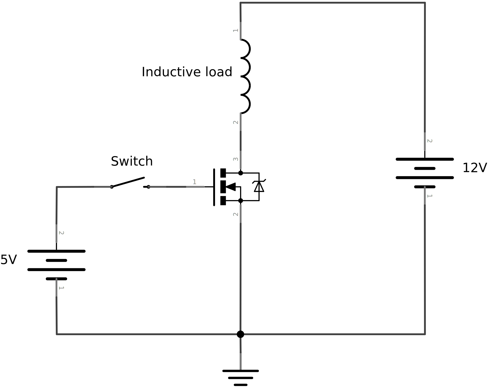
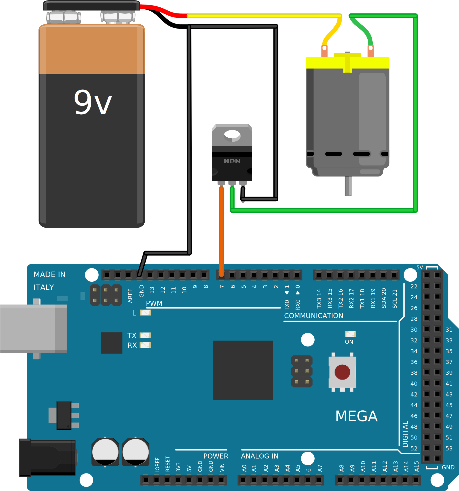

.. author: Lauri Võsandi <lauri.vosandi@gmail.com>
.. tags: Tiigriülikool, Arduino, Estonian IT College
.. language: et
.. license: cc-by-3
.. date: 2013-10-31

Induktorite juhtimine väljatransistori abil
===========================================

Sissejuhatus
------------

Väljatransistor (*FET* või *field-effect* *transistor*),
on `transistori <transistor.html>`_ alamliik,
mis on disainintud võimalikult kiireks lülitamiseks [#wikipedia-fet]_.
Väljatransistoreid valmistatakse erinevate tehnoloogiatega,
hetkel kõige populaarsemaid on isoleeritud paisuga väljatransistor
(*MOSFET* ehk *metal-oxide-semiconductor* *field-effect* *transistor*) [#wikipedia-mosfet]_.

.. [#wikipedia-fet] `Field-effect transistor - Wikipedia, the free encyclopedia <http://en.wikipedia.org/wiki/Field-effect_transistor>`_
.. [#wikipedia-mosfet] `MOSFET - Wikipedia, the free encyclopedia <http://en.wikipedia.org/wiki/MOSFET>`_

Väljatransistori lisamine skeemi
--------------------------------

Samamoodi nagu tavalisi transistoreid on PNP ja NPN siiretega,
on ka väljatransistoreid fundamentaalselt kahte tüüpi.
Digitaalsetes skeemides on kõige populaarsemad N-kanali
isoleeritud paisuga väljatransistorid.
Tüüpilisel väljatransistoril on ka sisseehitatud Zener-i diood
mis võimaldab sellega efektiivselt lülitada induktoreid (pool, mootor vms).
Zener-i diood paistab ilusti ka välja väljatransistori tingmärgil:

    Väljatransistori vooluringid

Mikokontrolleri külge ühendamine
--------------------------------

Väljatransistorist teeb eriti atraktiivse elektroonikakomponendi asjaolu,
et Arduino külge ühendades pole tavaliselt ühtegi lisakomponenti vaja:

    
    Arduino 9. jalaga mootori juhtimine väljatransistori abil
   
Säärasesse skeemi sobivad näiteks BS170 või IRF520 väljatransistorid.
