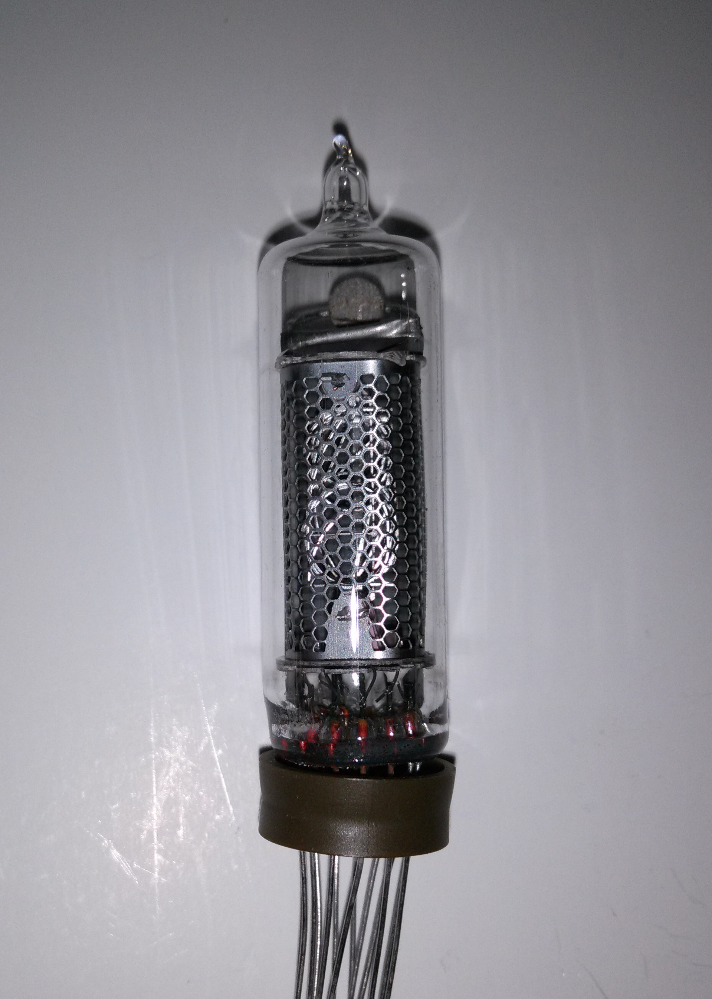
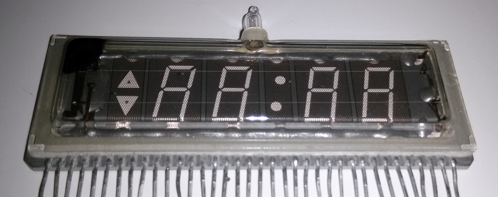

.. title: Nixie-lambid
.. author: Lauri Võsandi <lauri.vosandi@gmail.com>
.. license: cc-by-3
.. tags:  Arduino, Nixie
.. date: 2013-10-31

Sissejuhatus
------------

Kõige tavalisemad Nixie-lambid on neoongaasiga täidetud klaaslambid,
milles kujundi helendama panemiseks on vaja umbkaudu 130V ... 170V.
Voolu piiramiseks on jällegi takisti tarvilik.
Arduino abil juhtiud Nixie-kella jaoks leiab minu kirjutatud
tarkvara `siit <http://codebender.cc/sketch:14505>`_.

ИН-12А, ИН-12Б, ИН-15А, ИН-15Б
------------------------------

Kõige populaarsemaid Nõukogude päritolu Nixie-lambid,
sama pesa ja pingega (170V).
Erinevused järgnevad:

* ИН-12А - Numbrid 0-9
* ИН-12Б - Numbrid 0-9 ning komakoht vasakul all
* ИН-15А - SI ühikute prefiksid (µ, P, -, +, m, M, K, П, %, n)
* ИН-15Б - SI ühikud (W, F, Hz, H, V, S, Ω, A)

Foto ИН-12А lambist:

ИН-14
-----

ИН-16
-----

ИВ-3
----

ИЛЦ2-16/8
---------

NEC LD8129
----------

