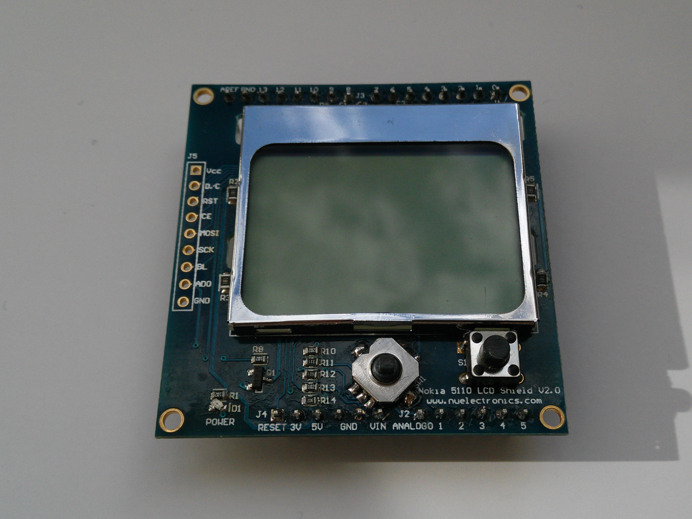

.. title: Nokia 5110 LCD Shield v2.0
.. author: Lauri Võsandi <lauri.vosandi@gmail.com>
.. license: cc-by-3
.. tags: Tiigriülikool, Arduino, Estonian IT College, PCD8544
.. date: 2014-06-07

Sissejuhatus
------------

Nokia 5110 ning Nokia 3310 mõlema ekraanid baseeruvad Philips PCD8544
integraalskeemil, mis on disainitud juhtima monokroomset 84x48 pikslilist LCD paneeli.
PCD8544 integraalskeemiga tutvumine selgitab LCD-ekraanide ning nende
kontrollerite tööpõhimõtteid ning annab praktilised teadmised
nimetatud kontrolleri juhtimisest.

LCD kontroller
--------------

LCD paneeli juhtimine ei ole lihtne, kuna on palju piksleid mida
individuaalselt elektrisignaaliga juhtima peab.
84x48 piksli puhul räägime 84 tulbast ning 48 reast pikslitest, mis teeb
kogu arvuks 4032 pikslit.
Nii suurt hulka väljaviike näiteks Arduino puhul pole võimalik ühendada ning
peab meeles pidama ka seda, et mikroskeemide tootmisel viib väljaviikude arvu
suurendamine märgatavalt hinda üles.
Selleks, et väljaviikude hulka vähendada kasutatakse LCD-paneelide puhul
nn. skanneerimise meetodit, mis tähendab et korraga uuendatakse 
vaid ühte rida piksleid, kuid uuendamine toimub mitmeid kordi sekundis ning
inimese silm seda ei taju. Ühe rea korraga uuendamine tähendab seda, 
et eelneva 84x48=4032 asemel on vaja kõigest 84+48=132 väljaviiku.

Ka 132 väljaviigu ühendamine mikrokontrolleriga oleks kulukas,
seetõttu kasutatakse LCD kontrolleri mikroskeeme, mis hõlbustavad
LCD pikslimaatriksi juhtimist. Philips PCD8544 on üks säärastest
LCD kontrolleritest.

Nu Electronics Nokia 5110 shield
--------------------------------

IT Kolledži robootikaklubis on kättesaadavad
Nu Electronics toodetud Nokia 5110 LCD Shield v2.0 plaadid,
mis on nii Arduino Uno kui Arduino Mega-ga ühilduvad:

Plaadil olev LCD-ekraan on sama eelnimetatud Philips PCD8544 kontrolleriga
ning ekraani jalad on ühendatud Arduinoga järgnevalt:

.. code::

    PCD8544 SCK (clock)        ↔ Arduino pin 13
    PCD8544 MOSI               ↔ Arduino pin 11
    PCD8544 SCE (chip enable)  ↔ Arduino pin 10
    PCD8544 RST (reset)        ↔ Arduino pin 9
    PCD8544 DC (data-command)  ↔ Arduino pin 8
    Taustvalgustus             ↔ Arduino pin 7
    Nupud                      ↔ Arduino pin A0
    
Koodinäide
----------

Koodinäide kasutades Adafruit GFX ning Adafruit PCD8544 teeke:

.. code:: cpp

    #include <Adafruit_GFX.h>
    #include <Adafruit_PCD8544.h>

    #define PCD8544_SCLK 13
    #define PCD8544_DIN  11
    #define PCD8544_DC   8
    #define PCD8544_CS   10
    #define PCD8544_RST  9
    #define PCD8544_BL   7

    #define KEY_LEFT 1
    #define KEY_CENTER 2
    #define KEY_DOWN 3
    #define KEY_UP 4
    #define KEY_RIGHT 5

    Adafruit_PCD8544 display = Adafruit_PCD8544(PCD8544_SCLK, PCD8544_DIN, PCD8544_DC, PCD8544_CS, PCD8544_RST);

    void setup() {
        // Sea taustvalgustuse pesa väljundi režiimi
        pinMode(PCD8544_BL, OUTPUT);

        // Initsialiseeri PCD8544 kontrolleri "tüürel"
        display.begin();
        
        // Sea pikslite kontrast
        display.setContrast(55); 
     
        // Kuva adafruit splashscreen 
        display.display();

        // Lülita taustvalgustus sisse sujuvalt  
        for (int j = 0; j < 255; j++) {
            analogWrite(PCD8544_BL, j);
            delay(10);
        }

        // Tühjenda puhver
        display.clearDisplay();

        // Muuda tekstisuurust
        display.setTextSize(1);
        
        // Liiguta tekstikursor vasakule-ülemisse nurka
        display.setCursor(0,0);
        display.println("Tere");

        // Liiguta tekstikursor 20 pikslit allapoole
        display.setCursor(0,20);
        display.println("maailm!");
        
        // Liiguta puhvri sisu ekraanile
        display.display();
        
        delay(2000);
    }

    int readKey(int key) {
        int value = analogRead(key);
        if (value < 30) {
            return KEY_LEFT;
        } else if (value < 150) {
            return KEY_CENTER;
        } else if (value < 360) {
            return KEY_DOWN;
        } else if (value < 535) {
            return KEY_UP;
        } else if (value < 760) {
            return KEY_RIGHT;
        } else {
            return 0;
        }
    }

    void loop() {
        display.clearDisplay();
        display.setCursor(0,0);
        display.println("Nupp:");
        display.setCursor(0,20);
        switch(readKey(A0)) {
            case KEY_LEFT:
                display.println("Vasakule");
                break;
            case KEY_CENTER:
                display.println("Keskele");
                break;
            case KEY_DOWN:
                display.println("Alla");
                break;
            case KEY_UP:
                display.println("Yles");
                break;
            case KEY_RIGHT:
                display.println("Paremale");
                break;
        }
        display.display();
        delay(5);
    }

Adafruit GFX teek realiseerib primitiivide (*pixel*, *line*, *circle* jne)
joonistamise algoritmid.
Adafruit PCD8544 realiseerib riistvaraga liidestamise Nokia 5110 ekraanile.
Mõlemad teegid tuleb lahti pakkida ~/sketchbook/libraries kataloogi,
täpsemad paigaldusjuhised leiab mõlema teegi Git lähtekoodivaramust.

Viited
------

Kasutatud materjalid ja teegid:

* `Nu Electronics Nokia 3310 LCD Shield With Joystick <http://shieldlist.org/nuelectronics/nokia-lcd>`_
* `Adafruit GFX Library <https://github.com/adafruit/Adafruit-GFX-Library/>`_
* `Adafruit PCD8544 Nokia 5110 LCD Library <https://github.com/adafruit/Adafruit-PCD8544-Nokia-5110-LCD-library/>`_
* `48x84 pixels matrix LCD controller/driver <http://www.sparkfun.com/datasheets/LCD/Monochrome/Nokia5110.pdf>`_
* `nuelectronics Nokia 5110 LCD Shield v2.0 pinout <http://mbed.org/users/SomeRandomBloke/code/N3310LCD/file/46bcc4e584c4/N3310SPIConfig.h>`_
