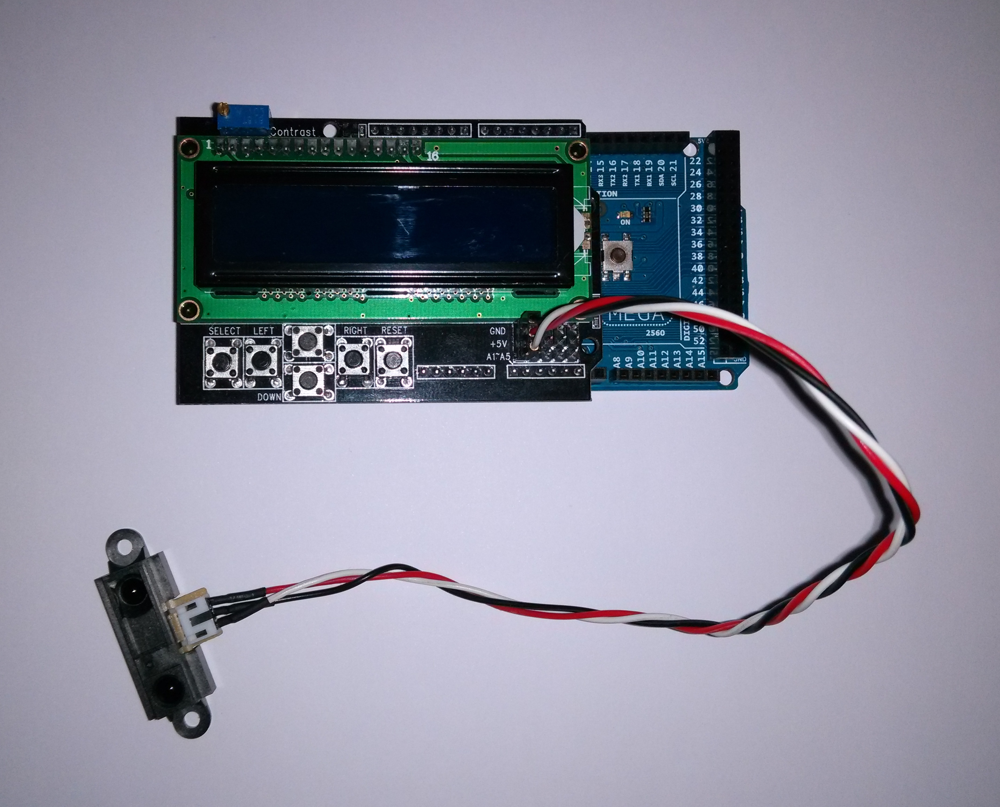
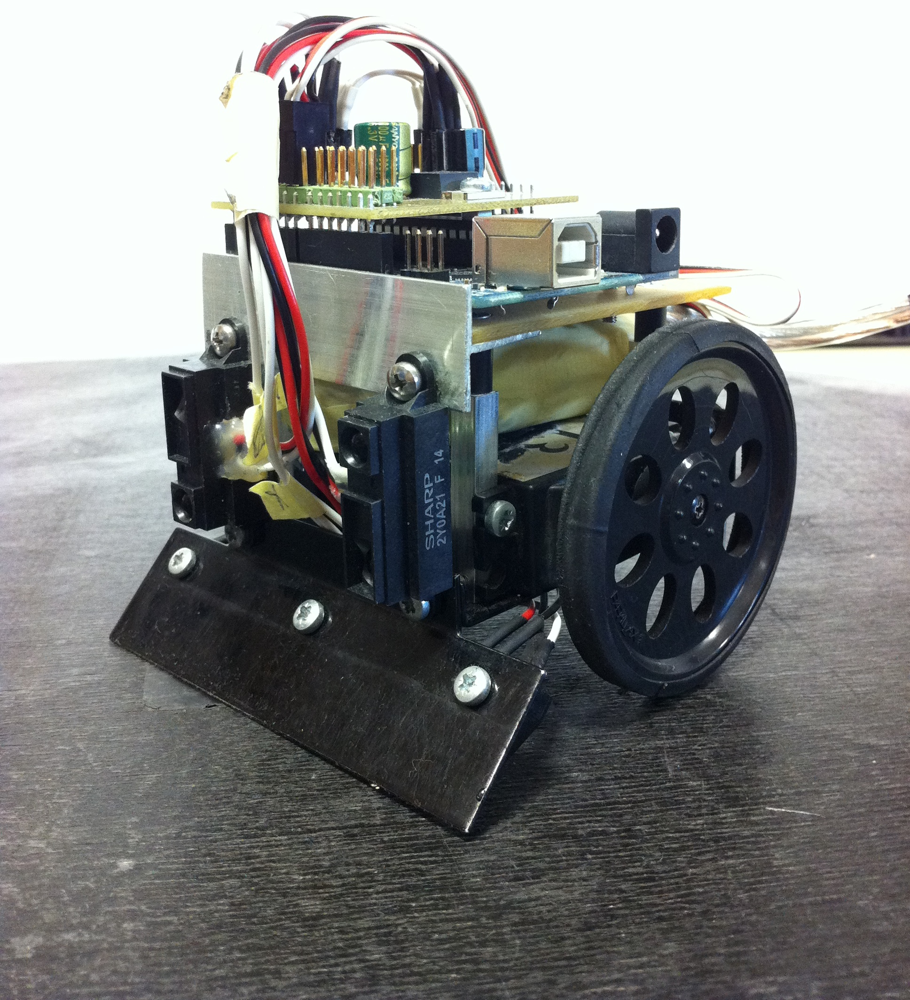

.. author: Lauri Võsandi <lauri.vosandi@gmail.com>
.. license: cc-by-3
.. tags: Tiigriülikool, Arduino, Estonian IT College
.. date: 2013-10-31

Sharp GP2Y0A21 analoogkaugussensor
==================================

Sissejuhatus
------------

Käesolev kaugussensor on väga lihtsa ülesehitusega.
Sensori toitepinge on 5V ning sensori väljundiks on pinge vahemikus 
0V kuni 3.2V, mis tähendab et seda võib vabalt kasutada ka 3.3V toitepingega
prototüüpimisplaatidega (nt `mbed <http://mbed.org/platforms/>`_):

    Sharp GP2Y0A21 kaugussensor

Tüüpilisel sumorobotil on kaks säärast kaugussensorit vastase asukoha
tuvastamiseks:

    Kaugussensorid sumorobotil

Sensori *datasheet*-ist leiab pinge ning kauguse vahelise seose graafiku:

.. chart:: Line
    :x_labels: ['0', '5', '10', '15', '20', '25', '30', '35', '40', '45', '50', '55', '60', '65', '70', '75', '80']
    :x_title: "Kaugus (cm)"
    :y_title: "Pinge (V)"
    :human_readable: False
    :fill: False
    :style: LightStyle
    :show_legend: False

    'Seos', [0, 3.2, 2.3, 1.7, 1.3, 1.1, 0.9, None, 0.7, None, 0.6, None, 0.5, None, 0.45, None, 0.4]

Kõige lihtsamas näites kasutame kaugussensorit, et käega ust avada:

.. code:: cpp

    #include <LiquidCrystal.h>

    LiquidCrystal lcd(8, 9, 4, 5, 6, 7);

    const char LCD_AUML = 0xE1;
    boolean garaaziuks_kinni = false;

    void setup() {
        lcd.begin(16, 2);
    }

    void loop() {
        int value = analogRead(A1);
        float voltage = value * 5 / 1023.0;
        int distance = 6762 / (value - 9) - 4;        
        if (distance < 15) {
            garaaziuks_kinni = !garaaziuks_kinni;
        }

        lcd.setCursor(0, 0);
        lcd.print(voltage, 2);
        lcd.print("V -> ");
        lcd.print(distance);
        lcd.print("cm");
        lcd.print("    ");            
        lcd.setCursor(0, 1);
        if (garaaziuks_kinni) {
            lcd.print("kinni");
        } else {
            lcd.print("lahti");
        }

        if (voltage < 0.4) {
            lcd.print(" ");
            lcd.print("ebat");
            lcd.print(LCD_AUML);
            lcd.print("pne");
        }

        lcd.print("                ");

        delay(500);
    }
    
Harjutused:

* Täienda koodi nii, et pikemat aega kätt sensori ees hoides ei 
  tehtaks ust kinni ja lahti mitu korda.

Viited
------

Kasutatud materjalid ja viited:

* `Proximity sensor <http://en.wikipedia.org/wiki/Proximity_sensor>`_
* `Sharp GP2Y0A21YK datasheet <http://www.sharpsma.com/webfm_send/1208>`_
* `Are we getting close? Proximity Sensors + Arduino
  <http://bildr.org/2011/03/various-proximity-sensors-arduino/>`_
* `Arduino library for the Sharp GP2Y0A21YK IR Distance sensor 
  <https://code.google.com/p/gp2y0a21yk-library/>`_ 
* `Sumoino shield <https://github.com/silps/sumoino/>`_
