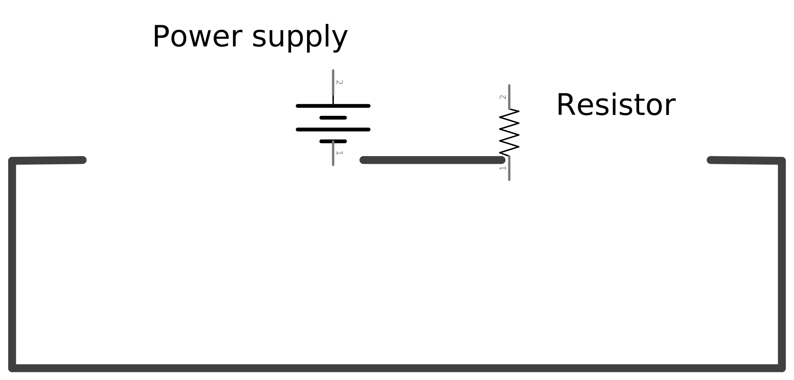

.. author: Lauri Võsandi <lauri.vosandi@gmail.com>
.. license: cc-by-3
.. tags: Tiigriülikool, Arduino, Estonian IT College
.. date: 2013-10-31

Füüsikatunni meeldetuletus
==========================

Sissejuhatus
------------

Käesolevas artiklis tuletame meelde füüsikatunnist tuttavad mõisted:
laeng, takistus, pinge, vool, võimsus ning energia.

Elektrilaeng
------------

Elektrilaeng (*electric* *charge*) on keha omadus osaleda
elektromagnetilises vastastikmõjus (*electromagnetic* *interaction*).
Elektrilaengu elementaarkandjateks on elektronid ning prootonid.
Elektroni ning prootoni laengud on võrdsed kuid erimärgilised,
öeldakse ka et elektroni ning prootoni laengud on *elementaarlaengud* ehk
et tegu on kõige väiksema võimaliku laenguga.
Tinglikult nimetatakse elektroni negatiivseks laengukandjaks ning
prootonit positiivseks laengukandjaks.
Elektrilaengu ühikuks on kulon (C), kuid kasutatakse ka elementaarlaengut (e):

.. math::

    e \approx 1.6 \times 10^{-19} C

Vesinik ehk kõige väiksem võimalik aatom koosneb ühest prootonist ning
ühest elektronist on elektrilaengu poolest neutraalne, mis tähendab et vesinikul
kokkuvõttes laengut pole.
Ilmselgelt nii väikeste mõõtühikutega pole igapäevases hobielektrooniku elus
palju peale hakata.
Punktlaeng on idealiseeritud laengukandja mudel,
makroskoopiliste objektide puhul moodustavad elementaarlaengud
suurema laengu.
Negatiivselt laetud kehal on elektrone ülearu ning
positiivselt laetud kehal on elektrone puudu.

Elektriline takistus ning juhtivus
----------------------------------

Elektriline takistus (*electrical* *resistance*)
on füüsikaline suurus, mis iseloomustab keha omadust avaldada
elektrilaengute liikumisele takistavat mõju.
Mida väiksem elektriline takistus, seda paremini keha elektrit juhib ning
vastupidi, mida suurem takistus seda halvemini keha elektrit juhib.
Takistuse mõõtühikuks on oom (Ω).

Eristatakse põhiliselt kolme kategooriat:

* Juhi takistus läheneb 0Ω, nt vaskjuhe
* Pooljuhi takistus on muudetav
* Isolaatori takistus on praktiliselt ∞Ω, nt õhk, plastik, keraamika, klaas

Elektriline *juhtivus* (*electrical* *conductance*) on termin mida kasutatakse
läbisegi takistusega ning see on oma olemuselt takistusele vastupidine.
Elektrijuhtivus on takistusega seotud pöördvõrdeliselt ning selle mõõtühikuks on
siimens (S).

Elektripinge
------------

Pinge (*voltage*) on elektriliste potensiaalide vahe
(*electric* *potential* *difference*) kahe elektriväljas asuva punkti vahel.
Tuletame meelde, et elektron on negatiivne laengukandja ning prooton on positiivne.
Tihtipeale kasutatakse ka elektroni puudumise ülestähendamiseks positiivse
laenguga "auku" (*electron* *hole*), mis tähendab et elektrijuhis elektronide
liikumine ühes suunas on ekvivalentne aukude liikumisega teises suunas.
Erimärgilised laengukandjad tõmbuvad ning samamärgilised tõukuvad.

Pinge kirjeldab vajalikku töö hulka, et liigutada elektrilaenguid nende punktide vahel.
Nii nagu raamatu maast üles võtmisel ning riiulile asetamisel on tarvis tööd teha,
on tarvis tööd teha et elektrone ühelt pingenivoolt teisele liigutada.

Oomi seadus
-----------

Oomi seadus kõneleb juhis tekkiva voolu seosest pinge ning juhi takistusega.

.. math::

    I = \frac{U}{R} \Longleftrightarrow U = I \times R \Longleftrightarrow  R = \frac{U}{I}

Kõige lihtsam skeem koosneb vooluallikast, elektritarbijast ning juhtmetest millega 
nad jadamisi vooluringiks on ühendatud:

    Vooluallikas (power supply) ning takisti (resistor) vooluringis

Ütleme, et tegu on raadio teel juhitava helikopteri skeemiga ning
VCC1 on näiteks aku ning R1 on helikopteri mootor.

Elektrivool
-----------

Elektripinge toiteallika klemmidel näitab toiteallika potensiaali teha tööd
elektronide liigutamise näol. Takistid vooluringis töötavad selle vastu.
Vool  (*electrical* *current*) väljendab kaudselt elektronide hulka,
mis reaalselt tööd teevad.
Võib öelda ka et pinge on põhjus siis vool on tagajärg mis sõltub takistusest.
Voolu mõõtühikuks on amper (A).
Mida rohkem ampreid seda suurema läbilõikega juhtmeid on tarvis.
Vool juhtmes osaleb ka vastastikmõjus magnetväljaga.

Teades vooluallika pinget ning tarbija takistust, saab arvutada ahelas tekkiva voolu.
Võtame näiteks raadioteel juhitava helikopteri, millel on 7.4V LiPo aku.
Helikopteri mootoriga teeme siinkohal lihtsustuse ja ütleme, et sellel on 0.37Ω takistus:

.. math::

    I = \frac{7.4V}{0.37Ω} = 20A

Internetiavarustest leiab 
`erinevaid tabeleid kaabli ristlõike pindala soovitustega <http://www.powerstream.com/Wire_Size.htm>`_.
Käesoleva võimsuse 20A tarbeks kuluvad ära umbkaudu vähemalt 1.3mm läbimõõduga
kaablid. Tähele tuleks panna seda, et enamus sääraseid tabeleid on lihtsalt orientiiriks.
Reaalsuses tuleb ikkagi läbi proovida, et ega
kaablid liiga tuliseks ei lähe või koguni isolatsiooni pealt maha sulata.
Suvaline juhe ei ole ideaalne, ka juhtmel on takistus ning
mõnes skeemis võib liiga peene juhtme takistus hakata segama ülejäänud skeemi tööd.
    

Elektrivõimsus
--------------

Elektrivõimsus (*electric* *power*) väljendab ajaühikus tehtud tööd,
sõltumata toitepingest ega tarbija takistusest.
Võimsuse mõõtühikuks SI-süsteemis on vatt (W).
Mõõtühikuna kasutatakse ka hobujõudu 1 hp = 746 W.

.. math::

    P = U \times I = \frac {U^2}{R} = I^2 \times R

Ülalnäidatud helikopteri näite jaoks saab tuletada ka võimsuse:

.. math::

    P = 7.4V \times 20A = 148W
    
Energia, töö
------------
Füüsikas kasutatakse termineid töö ning energia läbisegi, kuna mõlemad
tähendavad sama asja. Inimese tehtud töö muruniitja lükkamisel on 
täpselt samamoodi mõõdetav ja numbriliselt väljendatav kui robotniiduki kulutatud
elektrienergia.

Energia mõõtühikuks SI-süsteemis on džaul (J).
Elektroonikas kasutatakse tihtipeale terminit kilovattund (kWh).
Toidutööstuses ning soojusõpetuses räägitakse ka kilokaloritest (kcal).
Kõik need on energia ning töö mõõtmiseks sobilikud mõõtühikud, mis
on omavahel seotud järgnevalt:

.. math::

    1 J = 2.78 \times 10^{-7} kWh = 2.39 \times 10^{-4} kcal
    
Elektroonikas saame tuletada energia tarbija võimsuse ning sellel võimsusel käitatud aja järgi:

.. math::

    E = P \times t
    
Mängides näiteks 30 minutit helikopteriga:

.. math::

    E = 148W \times 30min = 148W * 0.5h = 74Wh = 0.074kWh
    
Eesti Energia hinnakirja järgi on hetkel rohelise 1kWh elektrienergia hinnaks 
6.60 senti, mis teeb selle lõbusõidu hinnaks pea pool senti:

.. math::

    0.074kWh \times 0.066\frac{€}{kWh} = 0.00488399€ \approx 0.005 €

Mahutavus
---------
    
Pea kõigis kaasaskantavates elektroonikaseadmetes on toiteallikaks aku.
Aku mahutavust mõõdetakse tavaliselt milliampertundides (mAh),
mõnel juhul ka vattundides (Wh).

.. important:: Aku **mahutavus** ning kondensaatori **mahtuvus** on kaks erinevat asja!

Teades aku nimipinget, võime arvutada kui palju energiat saab salvestada
akusse, näiteks eelnimetatud 7.4V aku puhul eeldame, 
et mahutavus on 2200mAh:

.. math::

    E = 7.4V \times 2200mAh = 16280mWh \approx 16.3Wh
    
See tähendab, et ühe laadimisega saab mängida umbkaudu 6 minutit:

.. math::

    E = P \times t \to t = \frac{16.3Wh}{148W} \approx 0.11h \approx 6.6min

Viited
------

* `Resistor <http://en.wikipedia.org/wiki/Resistor>`_
