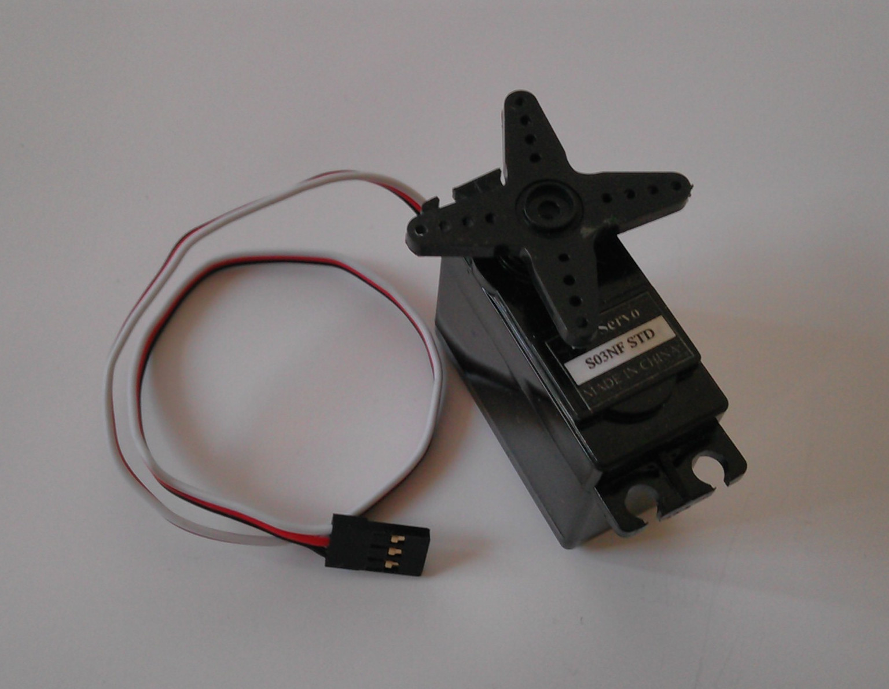

.. title: Servomootorite juhtimine Arduinoga
.. author: Lauri Võsandi <lauri.vosandi@gmail.com>
.. license: cc-by-3
.. tags: Tiigriülikool, Arduino, Estonian IT College
.. date: 2014-06-07

Sissejuhatus
------------

Robootikas ning mudelismis kasutatavad servomootorid ehk servod on
disainitud töötama 5V toitepingel ning sisendina kasutavad
pulsilaiusmoduleeritud signaali.
Servomootorist on tavaliselt välja toodud kolmejuhtmeline ühenduspesa:

* Must või pruun on ühendatud maha ehk pingenivoole 0V.
* Punane on ette nähtud 5V toitepinge jaoks.
* Kollane või valge on pulsilaiusmoduleeritud signaali jaoks.

Näide servomootorist:

Servomootor koosneb alalisvoolumootorist, aeglustavast ülekannest ning
kontrollerist, mis on suletud korpusesse:

Odavamate servomootorite ülekanne on plastikust hammasratastega,
kallimate puhul kasutatakse metallist hammasrattaid.
Servomootoreid on laias laastus kahte tüüpi: pildil näidatud
kiirusekontrolliga servomootor ning positsioonikontrolliga servomootor,
mis tavaliselt sisaldab potensiomeetrit mikrokontrolleri tagasideks.

Arduino puhul saab kasutada *Servo* teeki, mis hõlbustab pesade seadistamist ning
korrektse pulsilaiuse arvutamist kraadide järgi.
*Servo* teek vajab taimereid mida kasutatakse pulsilaiusmodulatsiooni võimekuse
jaoks Arduino Uno pesadel 9, 10 ning Arduino Mega 2560 puhul pesadel 11, 12.
*Servo* teegi kasutamisel ei ole võimalik nimetatud pesadel kasutada
klassikalist pulsslaiusmodulatsiooni *analogWrite()* funktsiooni kaudu isegi
siis, kui servo nende pesade külge ühendatud ei ole.
Kui *Servo* teek on laetud, saab servosid ühendada praktiliselt
kõikide pesade külge.

Positsioonikontrolliga servomootorite omapäraks on nende puhul kasutatav
pulsilaiusmodulatsiooniga signaal.
Kandesageduseks on 50Hz, millele vastab 20ms võnkeperiood.
Ühe mootori pulsilaius varieerub 1ms ning 2ms vahel.
Positsioonikontrolliga servomootori puhul on
pulsilaius tavaliselt korreleeritud järgnevalt:

* 1ms - 90 kraadi vastupäeva
* 1.5ms - 0 kraadi
* 2ms - 90 kraadi päripäeva

Positsioonikontrolliga servomootor
----------------------------------
Positsioonikontrolliga servomootoreid kasutatakse
lennumudelismis kaldtüüride, kõrgustüüride ning pöördetüüride liigutamiseks.
Positsioonikontrolliga servomootor püüab etteantud pulsilaiusmodulatsiooni
signaalile hoida servomootori võlli teatud nurga all.

Käesolev näide eeldab, et on tutvust tehtud
`analoogsisendi lugemisega <arduino-analog-input>`_.
Tegu on kõige lihtsama anduri (*sensor*) ning täituri (*actuator*) kooslusega.
Potensiomeetrit kasutatakse servomootorile nurga ette andmiseks.

Arduinosse võib algatuseks üles laadida järgneva koodijupi:

.. code:: cpp

    #include <Servo.h>
    
    Servo servo1;
    int servoPin = 13;
    int potentiometerPin = A0;

    void setup () {
        servo1.attach(servoPin); // Seadista servo taimerid
    }

    void loop() { 
        int value = analogRead(potentiometerPin); // Loe potensiomeetri väärtus
        int degree = map(value, 0, 1023, 0, 180); // Teisenda analoogsisendi näit ümber nurgaks
        servo1.write(degree);                     // Keera servo õigesse asendisse
        delay(5);
    }

Kiirusekontrolliga servomootor
------------------------------

Kiirusekontrolliga servomootor püüab hoida etteantud kiirust.
Pulsilaiused on seostatud järgnevalt:

* 1ms - 100% kiirusega ühes suunas
* 1.5ms - Mootor seisab
* 2ms - 100% kiirusega teises suunas

Tüüpilisel sumorobotil on kaks kiirusekontrolliga servomootorit roboti rataste
ringi ajamiseks:

.. image:: img/arduino-sumorobot.jpg
    :align: center

Viited
------

Kasutatud teegid ja viited:

* `Servo Library <http://arduino.cc/en/reference/servo>`_
* `Servomootor - Vikipeedia, vaba entsüklopeedia <http://et.wikipedia.org/wiki/Servomootor>`_
* `Sumoino shield <https://github.com/silps/sumoino/>`_
