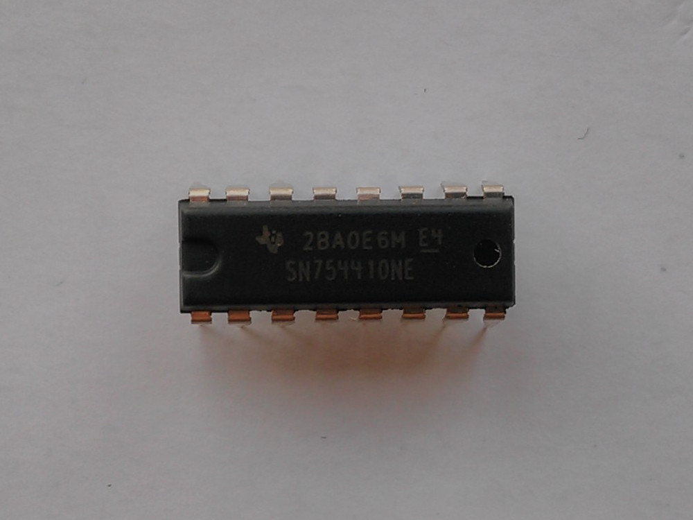
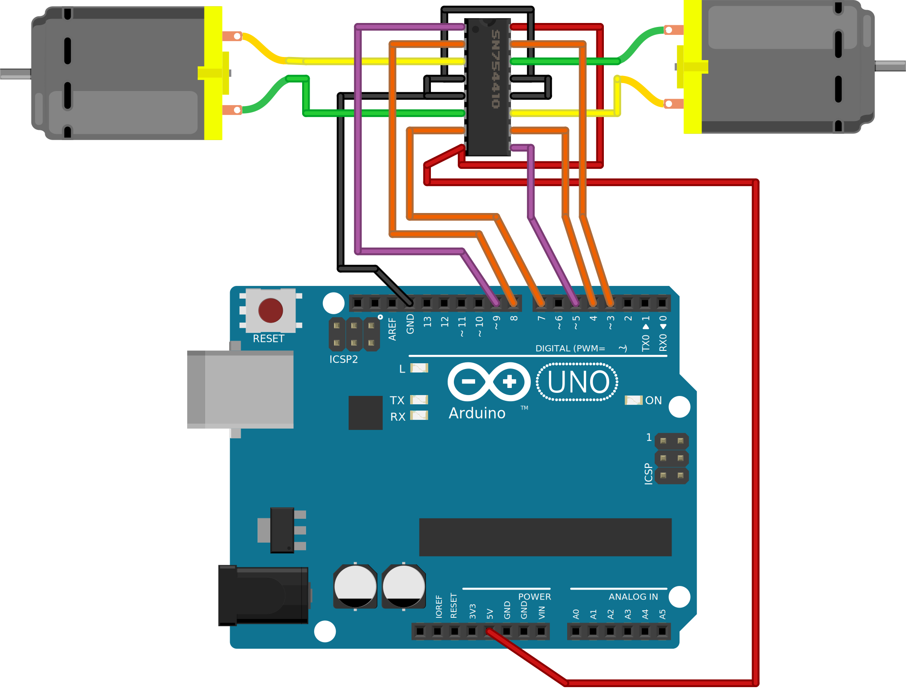

.. author: Lauri Võsandi <lauri.vosandi@gmail.com>
.. license: cc-by-3
.. tags: Tiigriülikool, Arduino, Estonian IT College
.. date: 2013-10-31

SN754410 quadruple half H-bridge driver
=======================================

Sissejuhatus
------------

SN754410 on oma olemuselt kaks H-silda kombineeritud ühte mikroskeemi:

    SN754410 mikroskeem

SN754410 *datasheet* annab ka väljaviikude tähistused:

.. code::

                   +---\__/---+
           1,2EN --| 1     16 |-- VCC1    
              1A --| 2     15 |-- 4A      
              1Y --| 3     14 |-- 4Y      
             GND --| 4     13 |-- GND     
             GND --| 5     12 |-- GND     
              2Y --| 6     11 |-- 3Y      
              2A --| 7     10 |-- 3A      
            VCC2 --| 8      9 |-- 3,4EN   
                   +----------+

Näidatud 16-ne väljaviigu hulgas on sisendeid kokku kuus.
Tähele tuleks panna seda, et mikoskeemi loogika vajab toidet 5V sõltumata sellest, 
kas sisenditel kasutatakse TTL pingenivoosid (3.3V) või CMOS pingenivoosid (5V).

* 1,2EN - Lülita sisse väljundid 1Y ning 2Y
* 1A - Muuda väljundi 1Y polaarsust
* 2A - Muuda väljundi 2Y polaarsust
* 3,4EN - Lülita sisse väljundid 3Y ning 4Y
* 3A - Muuda väljundi 3Y polaarsust
* 4A - Muuda väljundi 4Y polaarsust

Väljundeid on käesoleval mikroskeemil neli:

* 1Y - Esimene väljund kuni 1A
* 2Y - Teine väljund kuni 1A
* 3Y - Kolmas väljund kuni 1A
* 4Y - Neljas väljund kuni 1A

Täiendavad väljaviigud:

* GND - Maa
* VCC1 - Loogika toide (5V)
* VCC2 - Väljundite toide (4.5V kuni 36V)

Nimetatud mikroskeemi võib kasutada mitmes erinevas konfiguratsioonis
sõltuvalt saadaolevate jalgade arvust:

* Kahe alalisvoolumootori (*DC* *motor*) juhtimiseks mõlemas suunas
* Ühe kolmefaasilise mootori (*brushless* *DC* *electric* *motor*, *BLDC* *motor*) juhtimiseks
* Ühe steppermootori (*stepper* *motor*) juhtimiseks

Kõige lihtsamas näites ühendame SN75510 mikroskeemi Arduino ning kahe mikromootoriga:

    SN754410 abil kahe alalisvoolumootori juhtimine

Arduino koodis seadistame violetsete kaablitega ühendatud väljaviigud
pulsilaiusmodulatsiooni režiimi ning oranžide kaablitega ühendatud väljaviigud
digitaalväljundi režiimi:

.. code:: cpp

    int leftMotorEnablePin = 9;
    int leftMotorForwardPin = 8;
    int leftMotorReversePin = 7;

    int rightMotorEnablePin = 5;
    int rightMotorForwardPin = 4;
    int rightMotorReversePin = 3;

    void setup() {
        // Sea kõik pesad väljunditeks
        pinMode(leftMotorEnablePin, OUTPUT);
        pinMode(leftMotorForwardPin, OUTPUT);
        pinMode(leftMotorReversePin, OUTPUT);
        pinMode(rightMotorEnablePin, OUTPUT);
        pinMode(rightMotorForwardPin, OUTPUT);
        pinMode(rightMotorReversePin, OUTPUT);

        // Vasak mootor 33% võimsusega edaspidi käima
        digitalWrite(leftMotorForwardPin, HIGH);
        digitalWrite(leftMotorReversePin, LOW);
        analogWrite(leftMotorEnablePin, 85);

        // Pidurda parema mootoriga
        digitalWrite(rightMotorForwardPin, LOW);
        digitalWrite(rightMotorReversePin, LOW);
        digitalWrite(rightMotorEnablePin, HIGH);
    }

Järgnevalt võime tuletada ka käesoleva skeemi jaoks SN754410
sisendite tõeväärtustabeli ühe mootori kohta:

+--------+---------+---------+------------------------------------+
| enable | forward | reverse | mis juhtub?                        |
+--------+---------+---------+------------------------------------+
| LOW    | LOW     | LOW     | Vabajooks                          |
+--------+---------+---------+------------------------------------+
| LOW    | LOW     | HIGH    | Vabajooks                          |
+--------+---------+---------+------------------------------------+
| LOW    | HIGH    | LOW     | Vabajooks                          |
+--------+---------+---------+------------------------------------+
| LOW    | HIGH    | HIGH    | Vabajooks                          |
+--------+---------+---------+------------------------------------+
| HIGH   | LOW     | LOW     | Mootor pidurdab                    |
+--------+---------+---------+------------------------------------+
| HIGH   | LOW     | HIGH    | Mootor pöörleb tagurpidi           |
+--------+---------+---------+------------------------------------+
| HIGH   | HIGH    | LOW     | Mootor pöörleb edaspidi            |
+--------+---------+---------+------------------------------------+
| HIGH   | HIGH    | HIGH    | Mootor pidurdab                    |
+--------+---------+---------+------------------------------------+

Viited:

* `Driving a bipolar motor <http://www.jasonbabcock.com/computing/breadboard/bipolar/>`_
