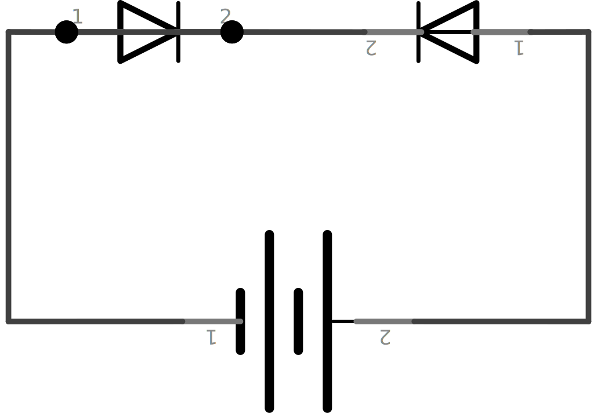

.. author: Lauri Võsandi <lauri.vosandi@gmail.com>
.. license: cc-by-3
.. tags: Tiigriülikool, Arduino, Estonian IT College
.. date: 2014-06-07

Transistoriga võimsate seadmete juhtimine
=========================================

Sissejuhatus
------------

Transistor on tavaliselt kolme väljaviiguga pooljuhtidest koosnev elektroonikakomponent [#wikipedia-transistor]_.
Transistore on väga erinevate omadustega alustades bipolaarsetest transistoritest mida
põhiliselt kasutatakse analoogsignaalide võimendamiseks lõpetades
väljatransistoritega mida kasutatakse põhiliselt lülitamiseks.

Kõige tavalisem bipolaartransistor koosneb piltlikult öeldes kahest
dioodist mis on ühendatud vastupidistes suundades.
Keskmiselt väljavõttelt parempoolsele jalale juhtivus on olemas
ning keskmiselt väljavõttelt vasakpoolsele jalale ka, aga 
äärmiste jalgade vahel juhtivus puudub mõlemas suunas:

Kui aga nüüd need kaks dioodi kokku suruda üheks komponendiks,
nimetagem seda siis näiteks transistoriks ning ühele dioodile
pinget anda juhtub üks kummaline nähtus -
eelnevalt läbimatu võileib muutub voolu juhtivaks.
Dioodis tekkiv vool vabastab nii palju elektrone, et teine diood hakkab voolu ka
tagurpidises suunas juhtima.

.. [#wikipedia-transistor] `Transistor <http://en.wikipedia.org/wiki/Transistor>`_

Siirded
-------

Kui `dioodi <diode.html>`_ puhul räägitakse PN siirdest siis ühendades kaks säärat siiret
vastandsuundades võime moodustada kas PNP või NPN siirde.
Lähtuvalt sellest on kaks fundamentaalselt kaks erinevat viisi kuidas transistorit
skeemi ühendada [#tech-thing-transistorskeemid]_:

    
.. [#tech-thing-transistorskeemid] `Transistorskeemid <http://robootika.tech-thing.org/failid/Skeemitehnika/04_transistorid.pdf>`_

PNP-transistor
--------------

PNP-transistori puhul tuleb transistori kolmandale vabale jalale (*baas*)
anda patarei toitepinge suhtes madalamat pinget, selleks 
et noolega näidatud jala (*kollektor*) kaudu hakkaks vool liikuma
*kollektor-baas* suunal, avades transistori *kollektor-emitter* suunal:

NPN-transistor
--------------

NPN-transistori puhul variandis tuleb transistori kolmandale vabale jalale (*baas*)
anda positiivset pinget, selleks et läbi noolega näidatud jala (*emitter*)
vool liikuma hakkaks *baas-emitter* suunal
ning transistori avaneks *kollektor-emitter* suunal:

Kas PNP või NPN?
----------------

Võib öelda et digitaalsetes seadmetes on NPN tüüpi transistorid populaarsemad,
kuna neid on lihtne skeemi sisse lisada.
Nagu näha ka viimasest NPN-transistoriga skeemist
siis lülitava skeemi (*baas-emitter* vooluring)
ning tarbija skeemi (*emitter-kollektor*) maa on ühised,
mis teeb pingetasemetega majandamise oluliselt lihtsamaks
võrreldes PNP-transistori skeemiga, kus ühiseks pingenivooks on tarbija
vooluallika pinge (12V).

Liidestamine mikrokontrolleriga
-------------------------------

Üks kõige populaarsemaid NPN tüüpi bipolaartransistoreid on 2N2222,
mis lubab tüürida kuni 40V pingega ning 500mA vooluga ahelat.
Tüüpilisel transistoril ei ole sisse ehitatud voolu piiravat takistit,
mistõttu mikrokontrolleriga liidestamisel tuleb kasutada takistit [#2n2222]_:

    
Tähelepanu peaks pöörama asjaolule, et seda skeemi ei saa kasutada näiteks
paljude mootorite, releede või muude seadmetega milles on poolid ehk mähised.
Pool on induktor ning induktor püüab voolu teket ning lakkamist takistada.
Vooluallika lülitamisel skeemi pool algul salvestab energia magnetvälja ning
vooluallika väljalülitamisel mangetvälja energia teisendatakse uuesti pingeks.

Põhiline probleem tavaliste transistoritega ongi see, et see pinge mida 
pool välja annab on hetkeline ja põhjustab suure voolu tagurpidises suunas.
Selle nähtuse vältimiseks kasutatakse dioodi mis sillatakse transistori 
emitteri ning kollektoriga.
Paljudel `väljatransistoritel <mosfet.html>`_ on säärane diood sisseehitatud.

.. [#2n2222] `Switching BlinkMs On/Off with Arduino <https://getsatisfaction.com/thingm/topics/digital_input_to_turn_blinkm_on_off_so_as_to_not_need_the_use_of_analogue_pins_on_arduino>`_

