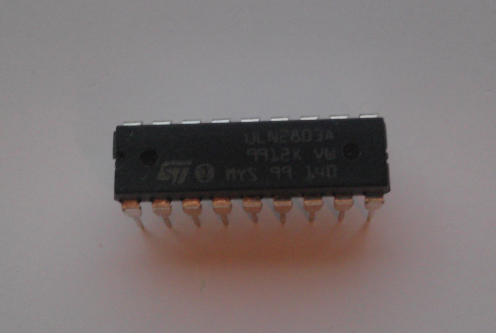
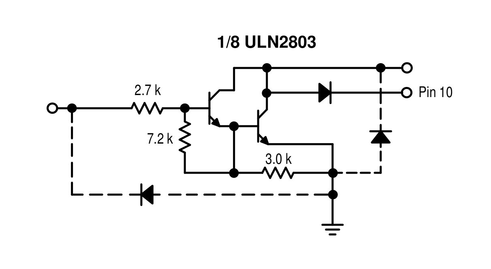
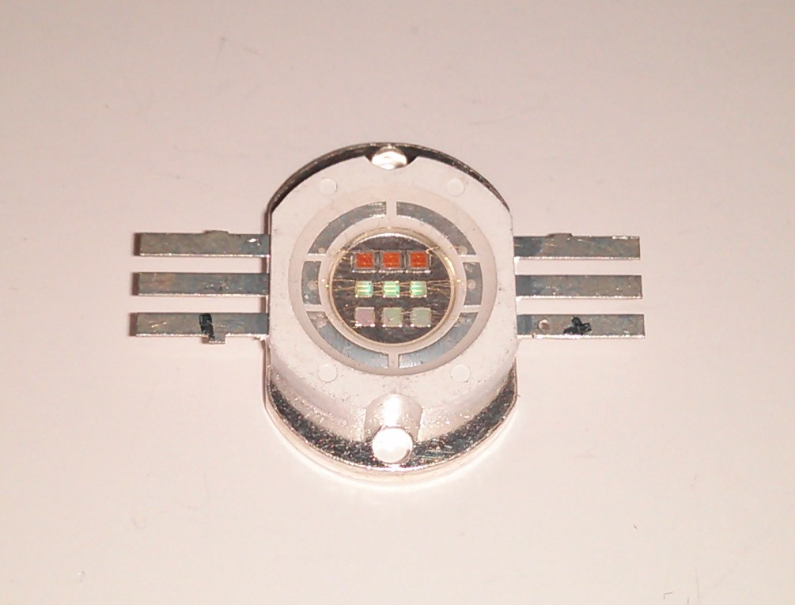
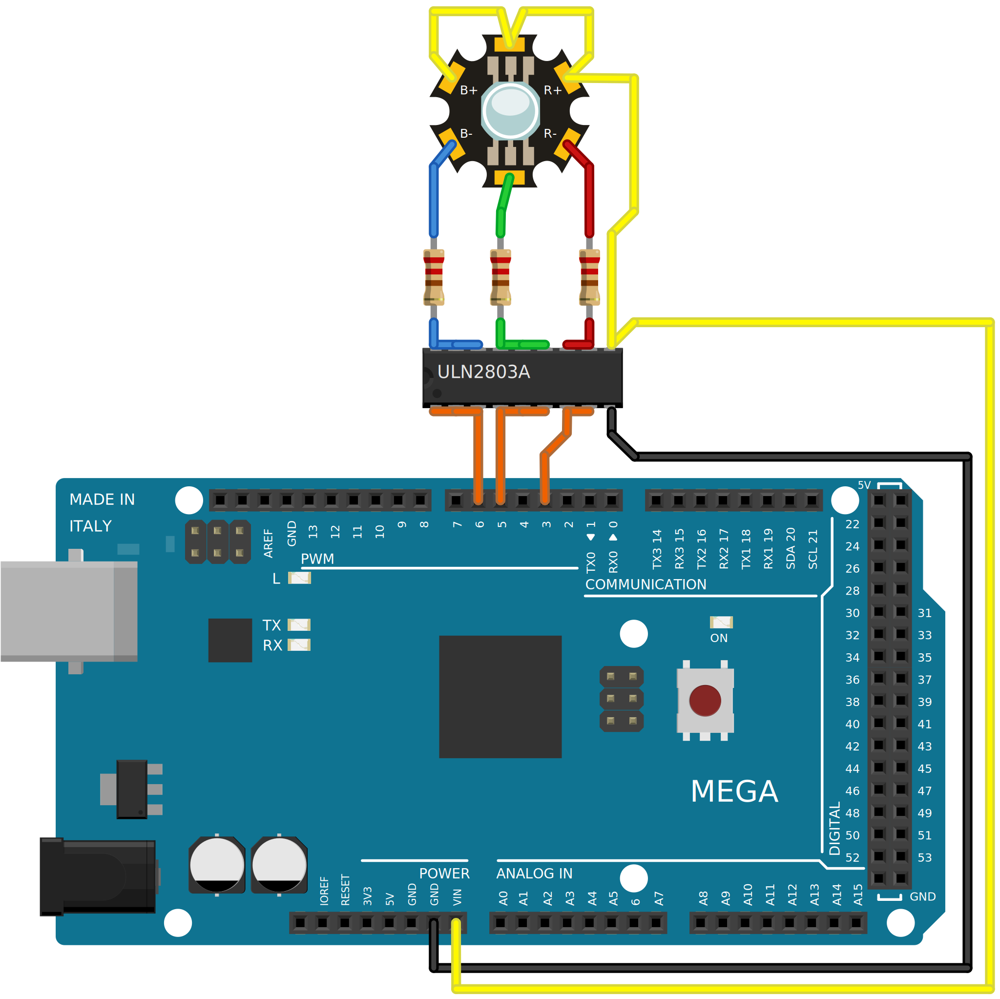
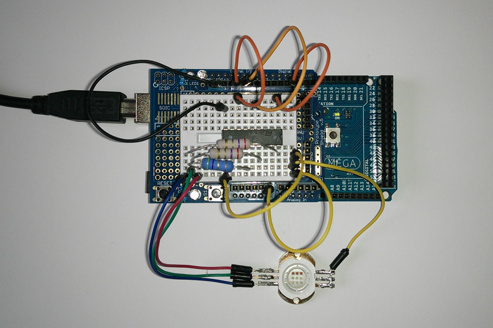

.. author: Lauri Võsandi <lauri.vosandi@gmail.com>
.. license: cc-by-3
.. tags: Tiigriülikool, Arduino, Estonian IT College
.. date: 2013-10-31

ULN2803 Darlington array
========================

ULN2803 on kaheksast Darlington transistorist koosnev mikroskeem,
mis võimaldab nii TTL (3.3V) kui ka CMOS (5V) pingetasemega loogika abil
juhtida kaheksat kuni 50V 0.5A ahelat.

    ULN2803 mikroskeem    

ULN2803 *datasheet* annab meile ka väljaviikude tähistused:

.. code::

           +---\__/---+
      1B --| 1     18 |-- 1C      
      2B --| 2     17 |-- 2C      
      3B --| 3     16 |-- 3C      
      4B --| 4     15 |-- 4C      
      5B --| 5     14 |-- 5C      
      6B --| 6     13 |-- 6C      
      7B --| 7     12 |-- 7C      
      8B --| 8     11 |-- 8C      
     GND --| 9     10 |-- COMM    
           +----------+
           
Nimetatud dokumendist leiab ka mikroskeemis realiseeritud komponentide skeemi,
kus B-C jala paarile vastab järgnev:

Nagu näha koosneb üks Darlington transistor kahest NPN-transistorist.
Kui tavalise transistori juhtimiseks näiteks 3.3V pingenivooga oleks tarvis 
takisti vahele panna, siis käesoleva mikroskeemi puhul on 2.7kΩ takisti juba
mikroskeemis realiseeritud. See tähendab seda, et mikrokontrolleri
ning ULN2803 vahele pole tarvis takisteid lisada.
Mikroskeemis realiseeritud takistid 7.2kΩ ning 3.0kΩ garanteerivad, et sisendi
puudumisel on sisendi pingenivoo 0V ringis, mis tähendab et väljund on justkui
välja lülitatud.

Skeemi koostamine
=================

Kõige lihtsamas näites ühendame ULN2803 mikroskeemi Arduino ning ühe
10W RGB LED-i ehk üpris võimsa värvilise valgusdioodiga, mis koosneb
kolmest jadamisi ühendatud punasest,
kolmest jadamisi ühendatud rohelisest ning
kolmest jadamisi ühendatud sinisest valgusdioodist:

    10W RGB LED

Järgnevas skeemis olevad takistid on vajalikud selleks, et
LED-id läbi ei põleks:

    RGB LED-i juhtimine ULN2803 abil
    
Elu teeb oluliselt lihtsamaks Arduino prototüüpimisplaadi (*breadboard*) ning
vastavate ühendusjuhtmete (*jumper* *wires*) olemasolu.
Käesoleva skeemi takistite väärtuseks osutusid katsetamise käigus
5.6Ω punase värvuse jaoks ning 3.3Ω sinise-rohelise värvuse jaoks:

    Skeem töös

Takisti väärtuste leidmine
==========================

Valgusdioodi jaoks sobiva takisti leidmine pole niisama lihtne,
tuleb arvestada seda, et valgusdioodi liiga suur vool ei läbiks ning ta läbi ei
põleks, samas liiga suur pingelang takistil tähendab seda, et protsentuaalselt suur
osa energiast läheb raisku kuna takisti kasulikku tööd naguinii ei tee.

Käesoleva näite puhul takistite väärtuste leidmise eelduseks olid
olid RGB LED-i dokumentatsioonist leitud näitajad:

* Maksimaalne võimsus kõigi kolme värvuse peale 10W;
* Pingelang punase (*forward* *voltage*) värvuse jaoks 7V kuni 8V;
* Pingelang rohelise ning sisise värvuse jaoks 10V kuni 11V;
* Iga värvi jaoks pidev maksimaalne vool (*max* *forward* *current*) 300mA;
* Iga värvi jaoks hetkeline maksimaalne vool (*peak* *pulse* *forward* *current*) 450mA,
  näiteks pulsilaiusmodulatsiooni rakendades.
  
Täiendavaks eelduseks oli see, et maksimaalse võimsuse juures oleks
punane-roheline-sinine toidetud nõnda, et moodustuks valge värvus.
Arduino toitmiseks oli plaanitud 12V, kuna 5V puhul ei oleks piisavalt pinget,
et käesoleva valgusdioodi ükski värvus süttiks. 
Tähele tuleks panna ka seda, et Darglinton transistorit läbides
rakendub pingelang sõltuvalt voolust 1.1V kuni 1.6V (*collector-emitter* *saturation* *voltage*).

Järgnevalt paneme formaalselt kirja olemasolevad andmed -
toitepinge, pingelang punast värvi valgusdioodil ning pingelang ULN2803 mikroskeemil:

.. math::

    U = 12V
    \Delta U_{diode} = 7V ... 8V
    \Delta U_{uln2803} = 1.1V ... 1.6V

Tuletame meelde, et antud juhul moodustavad vooluringi toiteallikas, üks
Darlington transistor ULN2803 mikroskeemis, punast värvi valgusdiood ning takisti.
Teades pingelangu ULN2803 mikroskeemis ning punasel valgusdioodil,
saame arvutada pingelangu takistil ning sealt edasi takisti väärtuse:

.. math::

    U = \Delta U_{diode} + \Delta U_{uln2803} + \Delta U_{resistor} \rightarrow
    
    \Delta U_{resistor} = U - \Delta U_{diode} - \Delta U_{uln2803}

    \Delta U_{resistor(min)} = U - \Delta U_{diode(max)} - \Delta U_{uln2803(max)} = 12V - 8V - 1.6V = 2.4V
    
    \Delta U_{resistor(max)} = U - \Delta U_{diode(min)} - \Delta U_{uln2803(min)} = 12V - 7V - 1.1V = 3.9V
    
    R_{resistor(min)} = \frac{\Delta U_{resistor(min)}}{I_{diode(peak)}} = \frac{2.4V}{450mA}= 5.3Ω
    
    R_{resistor(max)} = \frac{\Delta U_{resistor(max)}}{I_{diode(max)}} = \frac{3.9V}{300mA}= 13.0Ω
    
    R_{resistor} = 5.3Ω ... 13.0Ω
    
Analoogselt leiame rohelise ning sinise värvuse jaoks takisti väärtuse,
teades et pingelang selle värvuse puhul on 10V kuni 11V.

.. math::

    \Delta U_{diode} = 10V ... 11V

    \Delta U_{resistor(min)} = 12V - 11V - 1.6V = -0.6V \rightarrow takisti\ pole\ vajalik
    
    \Delta U_{resistor(max)} = 12V - 10V - 1.1V = 0.9V
   
    R_{resistor(max)} = \frac{\Delta U_{resistor(max)}}{I_{diode(max)}} = \frac{0.9V}{300mA}= 3.0Ω
    
    R_{resistor} = pole\ vajalik ... 3.0Ω

Kui nüüd tähelepanelikult viimast arvutuskäiku lugeda, siis rohelise-sinise
värvuse puhul peaks valgusdioodi enda ning Darlington transistori peale
tekkima juba üle 12V pingelangu, kuid ilma takistita ühendades ilmneb hoopiski,
et valgusdioodi läbiv vool on märgatavalt üle 450mA, seda selgitab asjaolu, 
et RGB valgusdioodi spetsifikatsioonis välja toodud numbrid on orienteeruvad
ning sõltuvad konkreetsest isendist, toitepingest, kombineeritud komponentidest jne.
Kõige mõistlikum viis on ikkagi pisut loominguliselt probleemile läheneda ning
multimeetriga üle kontrollida, et ühte
värvust läbiv vool ei ületaks 300mA.

Arvutuste tulemusena ilmnes, et punase värvuse jaoks oleks tarvis takistit
vahemikus 5.3Ω kuni 13Ω ning rohelise-sinise jaoks 3Ω kuni 0Ω.
Arvutuskäik annab lihtsalt takistuste vahemiku, mida proovima hakata,
tähele tuleks panna ka seda, et elektroonikakauplusest
ei saa suvalise väärtusega takisteid osta. 
Vahemikus 1Ω kuni 15Ω on reaalselt saada 1W võimsusega takisteid väärtusega:
1Ω, 1.2Ω, 1.5Ω, 2Ω, 2.2Ω, 2.7Ω, 3.3Ω, 3.9Ω, 4.7Ω, 5.6Ω, 6.8Ω, 8.2Ω.

.. code:: cpp

    // Pulsilausmodulatsiooni võimekusega jalad
    int redPin = 11;
    int greenPin = 10;
    int bluePin = 3;

    void setup() {};

    void setHSV(unsigned int h, unsigned char s, unsigned char v)
    {
        int f, p, q, t, r, g, b, i;
        if(s == 0) {
            r = g = b = v;
        } else {
            i = h / 43;
            f = (h - (i * 43)) * 6;
            p = (v * (255 - s)) >> 8;
            q = (v * (255 - ((s * f) >> 8))) >> 8;
            t = (v * (255 - ((s * (255 - f)) >> 8))) >> 8;
        	switch( i ) {
		    case 0:
		        r = v; g = t; b = p; break;
		    case 1:
		        r = q; g = v; b = p; break;
		    case 2:
		        r = p; g = v; b = t; break;
		    case 3:
		        r = p; g = q; b = v; break;
		    case 4:
		        r = t; g = p; b = v; break;
		    default:
                        r = v; g = p; b = q; break;
            }
        }
        analogWrite(redPin, r); 
        analogWrite(greenPin, g); 
        analogWrite(bluePin, b); 
    }

    void loop() {
        for(int hue = 0; hue < 255; hue++) {
            setHSV(hue, 255, 50);
            delay(20);
        }
    }

Viited
------

Materjalid ja viited:

* `HSV to RGB conversion function with only integer math
  <http://web.mit.edu/storborg/Public/hsvtorgb.c>`_
* `10W RGB LED
  <http://www.ebay.com/itm/2pcs-10W-RGB-LED-10-Watt-Lamp-Bright-Light-High-Power-Chip-For-Home-Light-DIY-/121008208358>`_
* `LED circuit <http://en.wikipedia.org/wiki/LED_circuit>`_
* `analogWrite() <http://arduino.cc/en/Reference/analogWrite>`_
