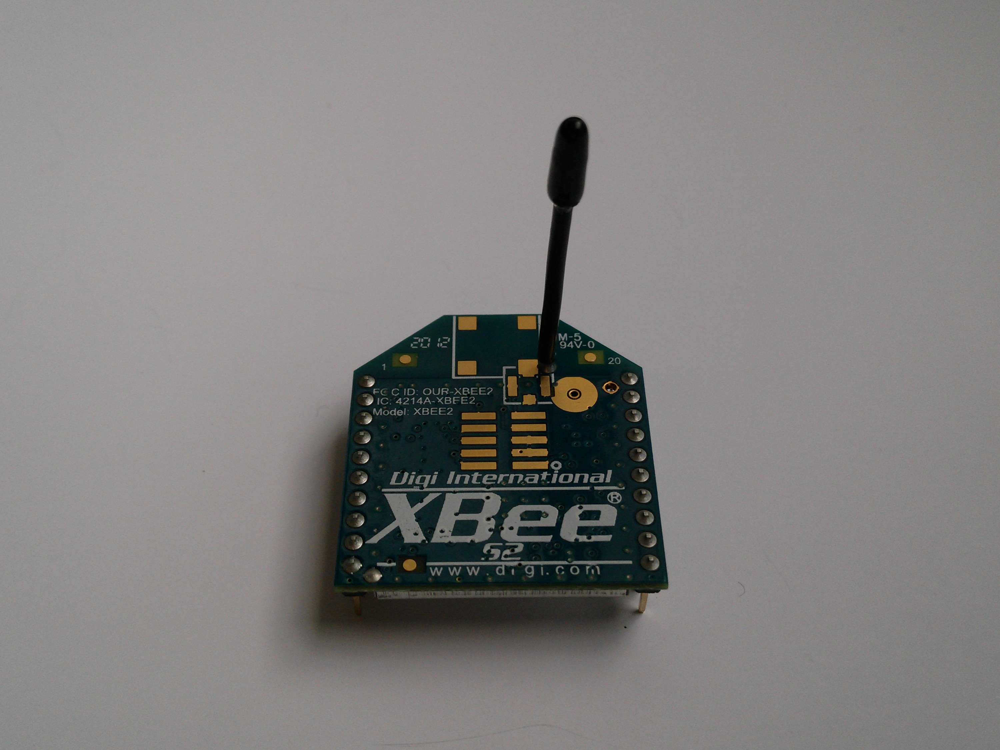
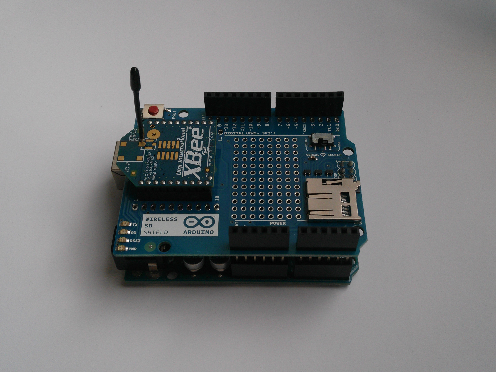

.. title: XBee S2
.. author: Lauri Võsandi <lauri.vosandi@gmail.com>
.. license: cc-by-3
.. tags: Tiigriülikool, Arduino, Estonian IT College, XBee, ZigBee, LR-WPAN
.. date: 2014-06-08

Sissejuhatus
------------

IEEE 802.15.4 standard defineerib füüsilise kihi omadused
madala ribalaiusega juhtmeta isiklikualavõrgu jaoks
(*LR-WPAN* ehk *low-rate* *wireless* *personal* *area* *network*).
Nimetatud standard on aluseks mitmete teiste kõrgema taseme
võrguprotokollide jaoks nagu ZigBee, ISA100.11a, WirelessHART, MiWi jne.

XBee S2
-------

XBee S2 moodul on `Digi International <http://www.digi.com>`_ toodetud moodul,
mis on üks paljudest moodulitest mis realiseerib ZigBee silmusvõrguprotokolli 
(*mesh* *network*):

   
Fotol on ka näha antenn, kuid leidub ka XBee mooduleid, mille antenn välja ei ulatu.
Kõige lihtsamal moel öeldes teeb XBee moodul UART ühenduse juhtmeta ühenduseks.
Täiendavalt on XBee moodulil ports programmeeritavaid jalgu, mida saab
kaug-AT käskudega (*remote* *AT* *commands*) juhtida.
XBee moodulil on 20 jalga:

.. code::

                         +--------------------+
                        /                      \
                       /                        \
 Power supply (3.3V) --| 1                   20 |-- AD0 / DIO0          
       UART data out --| 2                   19 |-- AD1 / DIO1          
        UART data in --| 3                   18 |-- AD2 / DIO2          
                DIO8 --| 4                   17 |-- AD3 / DIO3          
               Reset --| 5                   16 |-- RTS (Request-to-Send) / DIO6
        PWM0 / DIO10 --| 6                   15 |-- Association LED / DIO5
        PWM1 / DIO11 --| 7                   14 |-- NC                  
                  NC --| 8                   13 |-- Power/sleep LED     
         Sleep / DI8 --| 9                   12 |-- CTS (Clear-to-Send) / DIO7
                 GND --| 10                  11 |-- DIO4                
                       +------------------------+

Arduinoga ühendamiseks kasutame Wireless SD shieldi.

Käesoleval shieldil on SERIAL SELECT lüliti, mis MICRO režiimis lülitab
XBee mooduli Atmega mikrokontrolleri UART otstele ning USB režiimis 
lülitab XBee mooduli Arduino USB-jadaliides silla külge.

ZigBee võrgu ülesehitus
-----------------------

ZigBee võrgus eristatakse kolme erinevat rolli:

* Koordinaator (*coordinator*) - Organiseerib võrku ning autendib võrguga
  liitujaid, tavaliselt võrgutoitega
* Marsruuter (*router*) edastab pakette erinevate moodulite vahel
* Lõpppunkt (*end* *device*) on madala voolutarbega 

Silmusvõrgu omapäraks on see, et võrgusõlmed seadistavad end jooksvalt
ümber vastavalt vajadusele.

DigiMesh võrk
-------------

Käesolevale XBee S2 moodulile saab paigaldada ka DigiMesh toega püsivara.
DigiMesh on ZigBee protokollile väga sarnane silmusvõrgu protokoll.
DigiMesh võrgus ei ole ZigBee-le omast koordianator, marsruuter ja
lõpppunkt eristust, vaid kõik võrgu sõlmed on täpselt samasuguse tarkvaraga, 
tehes DigiMesh võrgust P2P (*peer-to-peer*) võrgu.

Püsivara ning seadistused
-------------------------

XBee moodulid tulevad tehasest marsruuteri püsivaraga (püsivara versioon 22A0).
ZigBee protokoll aga näeb ette, et võrgu moodustamiseks on vajalik üks
koordinaator. Selleks tuleb vähemalt ühele XBee moodulile paigaldada
koordinaatori püsivara (näiteks püsivara versioon 20A7).
Püsivara ning seadistuste laadimiseks XBee moodulitesse kasutatakse
X-CTU tarkvara, mis paraku toimib ainult Windows keskkonnas.
Algelise käsurea vahendi XBee moodulite seadistamiseks ning
püsivara uuendamiseks leiab käesolevate `õppematerjali lähtekoodipuust
<https://bitbucket.org/lauri.vosandi/bootcamp/src/tip/util/xbcfg.py>`_.
Lisaks on `pyctu <https://bitbucket.org/cswank/pyctu/>`_ nimelisel
projektil on sarnane eesmärk.

XBee S2 alglaadur
-----------------

Analoogselt GSM modemitele kasutatakse XBee moodulite seadistamiseks AT-käske.
Selleks et siseneda AT käskude režiimi tuleb XBee mooduli UART sissendisse
teha sekundiline paus, seejärel kirjutada "+++" ning oodata veel sekund.
Kirjutades seejärel "AT" ning tagasijooksu (*carriage* *return* ehk \\r),
peaks XBee moodul vastama kinnitusega "OK".
AT-režiimil on ka aegumine (*timeout*) peale mida XBee moodul läheb
tagasi oma tavapärasesse režiimi.

Püsivara saab uuendada vaid alglaaduri režiimis.
XBee moodulid kasutavad modifitseeritud Ember alglaadurit.
Tähele tuleks panna seda, et alglaaduri režiimis on *baud* *rate* alati 115 200.
Ember alglaaduri käsuviip on üsna iseenesestmõistetav:

.. code::

    EM250 Bootloader v20 b09

    1. upload ebl
    2. run
    3. ebl info
    BL >

Alglaaduri režiimi saamiseks on mitu varianti:

* Andes käsu AT%P olles AT käsu režiimis
* Täpselt ajastatud DTR ning RTS signaalidega manipuleerides üle UART ühenduse
* Füüsiliselt ühendada jalad 3 (DIN) ja 9 (DTR) maaga ning jalg 16 (RTS) ühendada
  toitega 3.3V. Andes toidet sääraselt ühendatud XBee moodulile,
  jääb XBee alglaadur pidama alglaaduri menüü juurde ning ei jätka
  XBee püsivara laadimisega isegi kui püsivara on kasutuskõlbatu ning
  AT režiimi siseneda võimalik pole

xbcfg
-----

Nimetatud *xbcfg* käsureatööriist on võrdlemisi lühike Python-keelne koodijupp
mis teeb Ubuntu ning Mac-i kasutajatel elu lihtsamaks ning
annab ka võimaluse XBee moodulite hingeeluga tutvumiseks.

Läbi USB-jadaliides silla ühendatud XBee mooduli puhul
saame mooduli olekut lugeda *status* käsuga:

.. code::

    localhost ~ # python xbcfg.py status
    Module status
    =============
    Association indication: Successfully formed or joined a network
    Channel: 0x10 (2.430 GHz)
    Supply voltage: 3344 mV (2100-3600mV ok)

    Module configuration
    ====================
    Network idenfitier: 0x3332
    Node idenfier: XB-0013A2004079C29E
    Packetization timeout: 3 sec
    Node discover timeout: 4.00 sec
    Baud rate: 9600
    Encryption enabled: False
    Power level: 2.00 dBm
    Destination address: 0x0013a200408b1a4a

    Module information
    ==================
    Serial number: 0x0013a2004079c29e
    Maximum payload: 84 bytes
    Hardware version: 0x194a
      Module type: XBee
      Revision: 74
    Firmware version: 0x20a7
      Variant: ZigBee compatible
      Operation: Coordinator, transparent operation
      Version: 10
      Revision: 7

XBee mooduli võrguseadistusi saab muuta *reset* käsuga

.. code::

    localhost ~ # python xbcfg.py reset --destination-address 0x000000000000ffff
    Restoring defaults ...
    Restarting firmware ...

Nimekirja võimalikest parameetritest mida muuta saab:

.. code::

    localhost ~ # python xbcfg.py reset -h
    usage: xbcfg.py reset [-h] [--verbosity LEVEL] [--device DEVICE] [--baud BAUD]
                          [--destination-address ADDRESS] [--channel CHANNEL]
                          [--node-identifier ID] [--network-identifier 0x3332]
                          [--enable-encryption] [--encryption-key 0xDEADC0DE]
                          [--node-discover-timeout SECONDS]

    XBee configuration and flashing utility

    optional arguments:
      -h, --help            show this help message and exit
      --verbosity LEVEL, -v LEVEL
                            Set verbosity (info, debug)
      --device DEVICE, -d DEVICE
                            Serial port
      --baud BAUD, -b BAUD  Initial baudrate for serial connection
      --destination-address ADDRESS, -da ADDRESS
                            Destination address (64-bit integer), defaults to
                            broadcast
      --channel CHANNEL, -ch CHANNEL
                            Channel (11-26)
      --node-identifier ID, -ni ID
                            Node identifier (20-character ASCII string)
      --network-identifier 0x3332, -id 0x3332
                            Network identifier (16-bit integer)
      --enable-encryption, -ee
                            Enable encryption
      --encryption-key 0xDEADC0DE, -psk 0xDEADC0DE
                            Encryption key (32-bit integer)
      --node-discover-timeout SECONDS, -nd SECONDS

Selleks, et paigaldada uut püsivara kasutame *flash* käsku:

.. code::

    localhost ~ # python xbcfg.py flash --operation end-device
    You're about to flash: ~/.xbee/ebl_files/XB24-ZB_28A7.ebl
    Press Enter to continue or Ctrl-C to bail out like a wimp!
    Successful flash, restarting firmware
    
Jadaliidese asendamine XBee moodulitega
---------------------------------------

Kahte XBee S2 moodulit saab kasutada jadaliidese asendamiseks.
Selleks tuleb ühele XBee moodulile paigaldada koorinaatori püsivara
ning teisele marsruuteri või lõpppunkti püsivara.
Mõlemad moodulid tuleb seadistada sama võrgu identifikaatori,
krüpteeringuga ja kanaliga.
Mooduli sihtaadressiks (*destination* *address*) tuleb panna
teise mooduli seerianumber (*serial* *number*),
Niiviisi on garanteeritud pakettide kohalejõudmine.
Vaikimisi sihtaadress on üldleviaadress (*broadcast* *address*) ning
üldleviaadressi puhul ei proovita pakette uuesti saata, mistõttu mõned
baidid võivad kaotsi minna. Üldleviaadressi puhul võivad viivitused olla
ka 5-10 sekundit.

Viited:

* `What is XBee and how is it different from ZigBee <http://electronics.stackexchange.com/questions/5314/what-is-xbee-and-how-is-it-different-from-zigbee>`_
* `XBee Series 2 OEM RF Modules <ftp://ftp1.digi.com/support/documentation/90000866_A.pdf>`_
* `Everything You Ever Wanted To Know About The Maxstream XBee Firmware Bootloader But Were Afraid To Ask <http://www.klozoff.ms11.net/maxstream/xbee-bootloader-info.txt>`_
* `Reverse engineering MaxStream boot loader <http://www.microchip.com/forums/m304986-print.aspx>`_
* `Arduino Wireless Shield <http://arduino.cc/en/Main/ArduinoWirelessShield>`_
